Exercise 1: Running containers

```bash
docker images
```

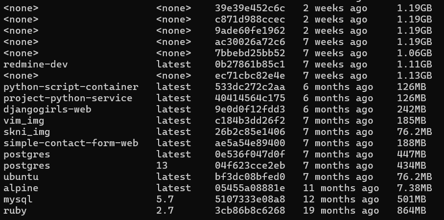

```bash
docker search <keyword>
```

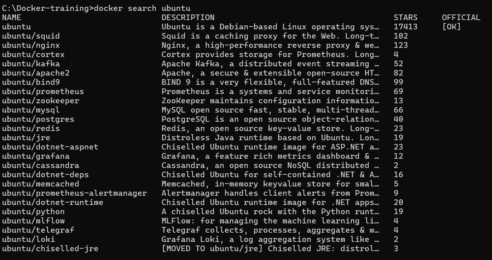

Run docker pull ubuntu:16.04 to pull an image of Ubuntu 16.04 from DockerHub.

```bash
docker pull ubuntu:16.04
```

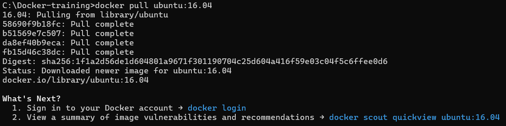

```bash
docker rmi cadfd9b26c33
```

Let's do a very simple example. Run docker run ubuntu:16.04 /bin/echo 'Hello world!'

```bash
docker run ubuntu:16.04 /bin/echo 'Hello world!'
```

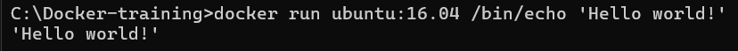

The ps command doesn't show stopped containers by default, add the -a flag.

```bash
docker ps -a
```

```bash
docker run ubuntu:16.04 /bin/bash
```

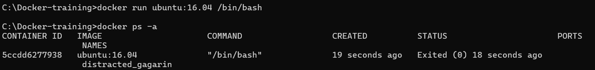

Instead, let's add the -it flags, which tells Docker to run the command interactively with your terminal.

```bash
$ docker run -it ubuntu:16.04 /bin/bash
```

Instead, let's add the -it flags, which tells Docker to run the command interactively with your terminal.

```bash
$ docker run -it ubuntu:16.04 /bin/bash
$ pwd
```


By adding the -d flag, we can run in detached mode, meaning the container will continue to run as long as the command is, but it won't print the output.

```bash
$ docker run -d ubuntu:16.04 /bin/sleep 3600
```

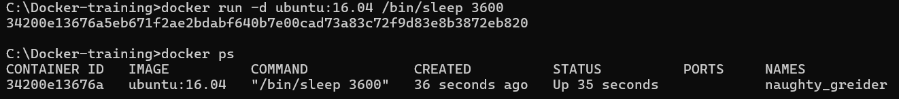

There is another command, called docker exec. docker exec runs a command within a container that is already running. It works exactly like docker run, except instead of taking an image ID, it takes a container ID.
This makes the docker exec command useful for tailing logs, or "SSHing" into an active container.

```bash
$ docker exec -it 342 /bin/bash
```

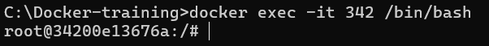

Let's list the running processes:

```bash
$ docker exec -it 342 /bin/bash
```

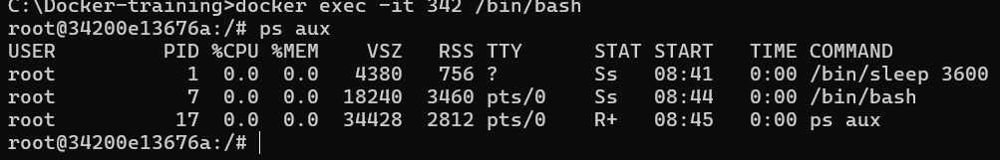

Stoping container

```bash
$ docker stop 342
```

Removing containers
To remove this we can use the docker rm command which removes stopped containers.

```bash
$ docker rm 342
```

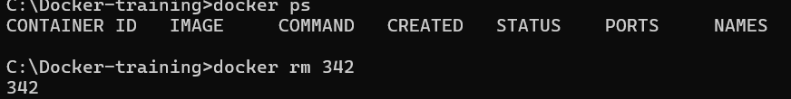

A nice shortcut for removing all containers from your system is docker rm $(docker ps -a -q)
It can be tedious to remove old containers each time after you run them. To address this, Docker also allows you to specify the --rm flag to the docker run command, which will remove the container after it exits.

```bash
$ docker run --rm ubuntu:16.04 /bin/echo 'Hello and goodbye!'
Hello and goodbye!
$ docker ps -a
CONTAINER ID        IMAGE               COMMAND             CREATED             STATUS              PORTS               NAMES
$
```

Exercise 2: Changing images
First start the container with /bin/bash:
Try running ping in the terminal.

```bash
$ C:\Docker-training> docker run -it ubuntu:16.04 /bin/bash
root@8b559ea51a87:/# ping google.com
bash: ping: command not found
root@8b559ea51a87:/#
```

The command doesn't exist. The Ubuntu image for Docker only has the bare minimum of software installed to operate the container. That's okay though: we can install the ping command.

![venv]j/(2.1.png)

In Debian-based Linux environments (such as Ubuntu), you can install new software using the apt package manager. For those who have experience with Macs, this program is the equivalent of homebrew.
By default, to reduce the image size, the Ubuntu image doesn't have a list of the available software packages. We need to update the list of available software:

```bash
$ apt-get update
```

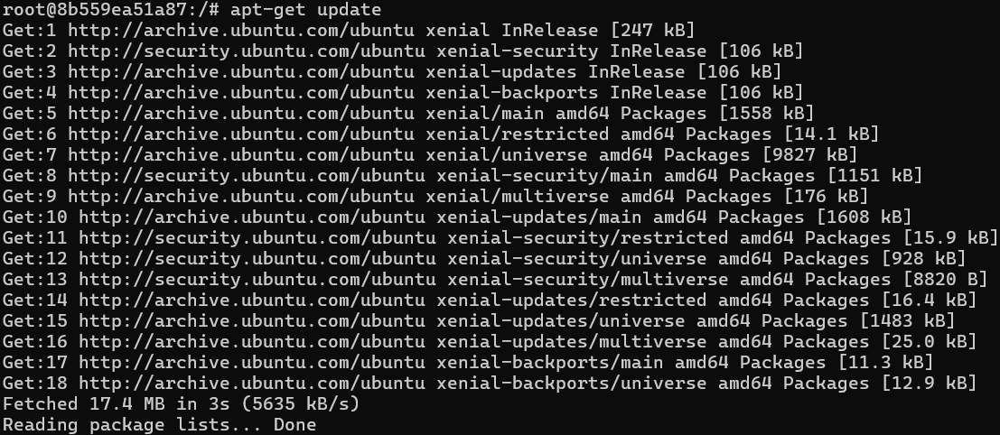

Call apt-get install iputils-ping to install the package containing ping

```bash
$ apt-get install iputils-ping
```

Ping your favorite website. When you've seen enough, Ctrl+C to interrupt, then exit the container.

```bash
$ ping google.com
```

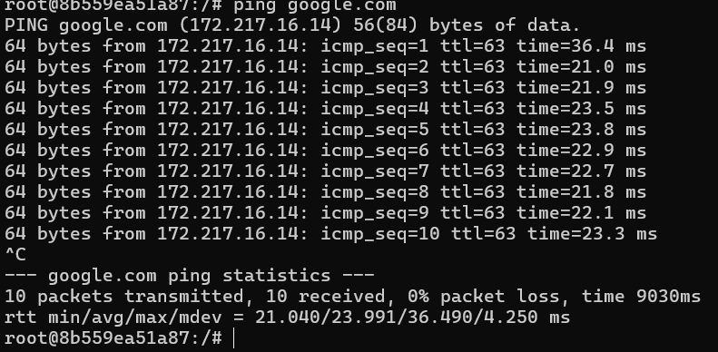

Committing changes
Pass the container ID, an author, commit message, and give it the name <DockerHub username>/ping:

```bash
$ docker commit -a 'David Elner' -m 'Added ping utility.' 786 delner/ping
docker images
```


Exercise 3: Building images
Creating a Dockerfile
Create a new file named Dockerfile in your working directory:
$ touch Dockerfile
$

Inside the file, we'll need to add some important headers.
The FROM directive specifies what base image this new image will be built upon. (Ubuntu in our case.)
The LABEL directive adds a label the image. Useful for adding metadata.
The RUN directive runs a command inside the image, and rolls any changes to the filesystem into a commit. A typical Dockerfile will contain several RUN statements, each committing their changes on top of the previous.

```bash
FROM ubuntu:16.04
LABEL author="David Elner"
RUN apt-get update
RUN apt-get install -y iputils-ping
```

Building the Dockerfile
To build Docker images from Dockerfiles, we use the docker build command. The docker build command reads a Dockerfile, and runs its instructions to create a new image

```bash
docker build -t delner/ping .
```

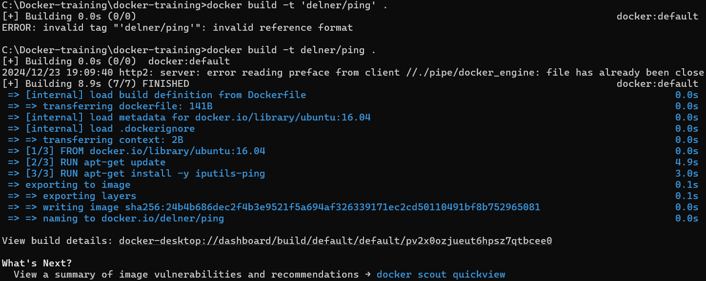

Optimizing the Dockerfile

```bash
REPOSITORY                TAG       IMAGE ID       CREATED          SIZE
delner/ping               latest    24b4b686dec2   50 minutes ago   167MB
```

In our case, the use of apt-get generates a lot of this fluff we don't need in our image. We'll need to modify these RUN directives slightly.
We can start with removing any old logs after the install completes. Adding the following to the bottom of the Dockerfile:

```bash
RUN apt-get clean \
    && cd /var/lib/apt/lists && rm -fr *Release* *Sources* *Packages* \
    && truncate -s 0 /var/log/*log
```

```bash
$ docker images
REPOSITORY          TAG                 IMAGE ID            CREATED             SIZE
delner/ping         latest              912bc1c7c059        4 seconds ago       159MB
```

No changes
Turns out because how commits are layered one upon the other, if there's fluff hanging around from a previous commit, it won't matter if you clean it up in a future RUN directive. It will be permanently apart of the history, thus the image size.
The easiest way to deal with this is to collapse all of the related RUN directives together

```bash
FROM ubuntu:16.04
LABEL author="David Elner"

RUN apt-get update \
    && apt-get install -y iputils-ping \
    && apt-get clean \
    && cd /var/lib/apt/lists && rm -fr *Release* *Sources* *Packages* \
    && truncate -s 0 /var/log/*log
```

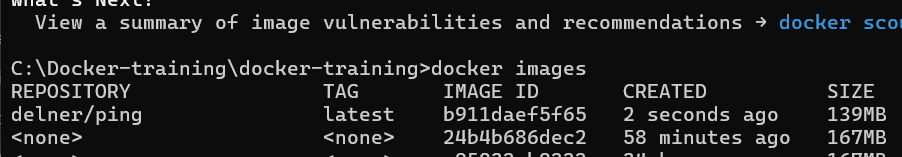

Other Dockerfile directives
There are many other useful directives available in the Dockerfile.

Some important ones:

COPY: Copy files from your host into the Docker image.
WORKDIR: Specify a default directory to execute commands from.
CMD: Specify a default command to run.
ENV: Specify a default environment variable.
EXPOSE: Expose a port by default.
ARG: Specify a build-time argument (for more configurable, advanced builds.)
Since our Dockerfile is build for ping, let's add the ENV and CMD directives.

```bash
FROM ubuntu:16.04
LABEL author="David Elner"

ENV PING_TARGET "google.com"

RUN apt-get update \
    && apt-get install -y iputils-ping \
    && apt-get clean \
    && cd /var/lib/apt/lists && rm -fr *Release* *Sources* *Packages* \
    && truncate -s 0 /var/log/*log

CMD ["sh", "-c", "ping $PING_TARGET"]
```

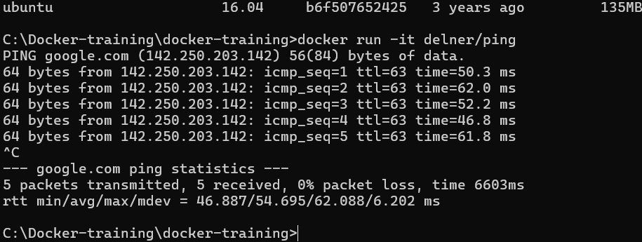

END OF EXERCISE 3
