Exercise 1: Running containers

```bash
docker images
```


```bash
docker search <keyword>
```


Run docker pull ubuntu:16.04 to pull an image of Ubuntu 16.04 from DockerHub.

```bash
docker pull ubuntu:16.04
```


```bash
docker rmi cadfd9b26c33
```

Let's do a very simple example. Run docker run ubuntu:16.04 /bin/echo 'Hello world!'

```bash
docker run ubuntu:16.04 /bin/echo 'Hello world!'
```


The ps command doesn't show stopped containers by default, add the -a flag.

```bash
docker ps -a
```

```bash
docker run ubuntu:16.04 /bin/bash
```


Instead, let's add the -it flags, which tells Docker to run the command interactively with your terminal.

```bash
$ docker run -it ubuntu:16.04 /bin/bash
```

Instead, let's add the -it flags, which tells Docker to run the command interactively with your terminal.

```bash
$ docker run -it ubuntu:16.04 /bin/bash
$ pwd
```


By adding the -d flag, we can run in detached mode, meaning the container will continue to run as long as the command is, but it won't print the output.

```bash
$ docker run -d ubuntu:16.04 /bin/sleep 3600
```


There is another command, called docker exec. docker exec runs a command within a container that is already running. It works exactly like docker run, except instead of taking an image ID, it takes a container ID.
This makes the docker exec command useful for tailing logs, or "SSHing" into an active container.

```bash
$ docker exec -it 342 /bin/bash
```


Let's list the running processes:

```bash
$ docker exec -it 342 /bin/bash
```


Stoping container

```bash
$ docker stop 342
```

Removing containers
To remove this we can use the docker rm command which removes stopped containers.

```bash
$ docker rm 342
```


A nice shortcut for removing all containers from your system is docker rm $(docker ps -a -q)
It can be tedious to remove old containers each time after you run them. To address this, Docker also allows you to specify the --rm flag to the docker run command, which will remove the container after it exits.

```bash
$ docker run --rm ubuntu:16.04 /bin/echo 'Hello and goodbye!'
Hello and goodbye!
$ docker ps -a
CONTAINER ID        IMAGE               COMMAND             CREATED             STATUS              PORTS               NAMES
$
```

Exercise 2: Changing images
First start the container with /bin/bash:
Try running ping in the terminal.

```bash
$ C:\Docker-training> docker run -it ubuntu:16.04 /bin/bash
root@8b559ea51a87:/# ping google.com
bash: ping: command not found
root@8b559ea51a87:/#
```

The command doesn't exist. The Ubuntu image for Docker only has the bare minimum of software installed to operate the container. That's okay though: we can install the ping command.

![venv]j/(2.1.png)

In Debian-based Linux environments (such as Ubuntu), you can install new software using the apt package manager. For those who have experience with Macs, this program is the equivalent of homebrew.
By default, to reduce the image size, the Ubuntu image doesn't have a list of the available software packages. We need to update the list of available software:

```bash
$ apt-get update
```


Call apt-get install iputils-ping to install the package containing ping

```bash
$ apt-get install iputils-ping
```

Ping your favorite website. When you've seen enough, Ctrl+C to interrupt, then exit the container.

```bash
$ ping google.com
```


Committing changes
Pass the container ID, an author, commit message, and give it the name <DockerHub username>/ping:

```bash
$ docker commit -a 'David Elner' -m 'Added ping utility.' 786 delner/ping
docker images
```


Exercise 3: Building images
Creating a Dockerfile
Create a new file named Dockerfile in your working directory:
$ touch Dockerfile
$

Inside the file, we'll need to add some important headers.
The FROM directive specifies what base image this new image will be built upon. (Ubuntu in our case.)
The LABEL directive adds a label the image. Useful for adding metadata.
The RUN directive runs a command inside the image, and rolls any changes to the filesystem into a commit. A typical Dockerfile will contain several RUN statements, each committing their changes on top of the previous.

```bash
FROM ubuntu:16.04
LABEL author="David Elner"
RUN apt-get update
RUN apt-get install -y iputils-ping
```

Building the Dockerfile
To build Docker images from Dockerfiles, we use the docker build command. The docker build command reads a Dockerfile, and runs its instructions to create a new image

```bash
docker build -t delner/ping .
```


Optimizing the Dockerfile

```bash
REPOSITORY                TAG       IMAGE ID       CREATED          SIZE
delner/ping               latest    24b4b686dec2   50 minutes ago   167MB
```

In our case, the use of apt-get generates a lot of this fluff we don't need in our image. We'll need to modify these RUN directives slightly.
We can start with removing any old logs after the install completes. Adding the following to the bottom of the Dockerfile:

```bash
RUN apt-get clean \
    && cd /var/lib/apt/lists && rm -fr *Release* *Sources* *Packages* \
    && truncate -s 0 /var/log/*log
```

```bash
$ docker images
REPOSITORY          TAG                 IMAGE ID            CREATED             SIZE
delner/ping         latest              912bc1c7c059        4 seconds ago       159MB
```

No changes
Turns out because how commits are layered one upon the other, if there's fluff hanging around from a previous commit, it won't matter if you clean it up in a future RUN directive. It will be permanently apart of the history, thus the image size.
The easiest way to deal with this is to collapse all of the related RUN directives together

```bash
FROM ubuntu:16.04
LABEL author="David Elner"

RUN apt-get update \
    && apt-get install -y iputils-ping \
    && apt-get clean \
    && cd /var/lib/apt/lists && rm -fr *Release* *Sources* *Packages* \
    && truncate -s 0 /var/log/*log
```


Other Dockerfile directives
There are many other useful directives available in the Dockerfile.

Some important ones:

COPY: Copy files from your host into the Docker image.
WORKDIR: Specify a default directory to execute commands from.
CMD: Specify a default command to run.
ENV: Specify a default environment variable.
EXPOSE: Expose a port by default.
ARG: Specify a build-time argument (for more configurable, advanced builds.)
Since our Dockerfile is build for ping, let's add the ENV and CMD directives.

```bash
FROM ubuntu:16.04
LABEL author="David Elner"

ENV PING_TARGET "google.com"

RUN apt-get update \
    && apt-get install -y iputils-ping \
    && apt-get clean \
    && cd /var/lib/apt/lists && rm -fr *Release* *Sources* *Packages* \
    && truncate -s 0 /var/log/*log

CMD ["sh", "-c", "ping $PING_TARGET"]
```


END OF EXERCISE 3

Exercise 4: Sharing images
In this exercise, I'll learn how to share Docker images using DockerHub. DockerHub is GitHub for Docker: a great place to find community images, and upload your own to.

```bash
C:\Docker-training\docker-training>docker login
Log in with your Docker ID or email address to push and pull images from Docker Hub. If you don't have a Docker ID, head over to https://hub.docker.com/ to create one.
You can log in with your password or a Personal Access Token (PAT). Using a limited-scope PAT grants better security and is required for organizations using SSO. Learn more at https://docs.docker.com/go/access-tokens/

Username: wisienkaa
Password:

Login Succeeded
```

Use the docker search command to search for new images:
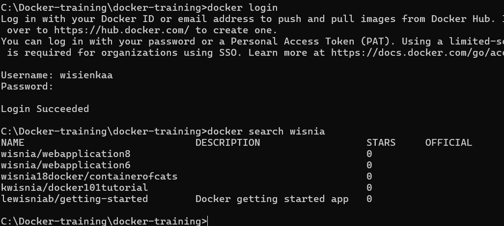

Tagging images
In the previous exercise "Building Images", we built and tagged an image as delner/ping. We can re-tag it.
Just use docker tag to add a new tag with your DockerHub user name, and give it a version:

```bash
C:\Docker-training\docker-training> docker tag delner/ping wisienkaa/ping:1.0
C:\Docker-training\docker-training>docker images
REPOSITORY                TAG       IMAGE ID       CREATED             SIZE
delner/ping               latest    c289ea80a314   About an hour ago   139MB
wisienkaa/ping            1.0       c289ea80a314   About an hour ago   139MB
```

The same image ID now maps to both the old and new tag. To remove the old tag, run docker rmi with the old image tag:
C:\Docker-training\docker-training>docker rmi delner/ping
Untagged: delner/ping:latest
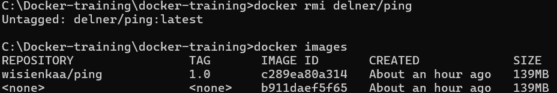

Pushing images
To push an image, all is needed to do is call docker push with the tag.
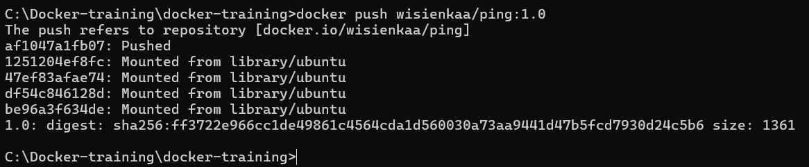

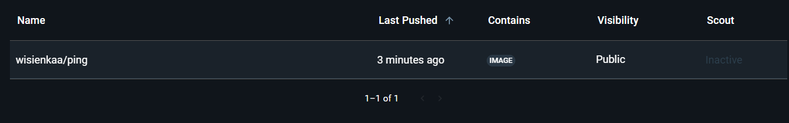

Exercise 5: Volumes
In this exercise, I'll learn to work with Docker volumes, for persisting data between containers.
To accomplish this, I'll setup an Apache HTTPD web server, and persist some HTML files in a volume.

Running my Apache HTTPD server
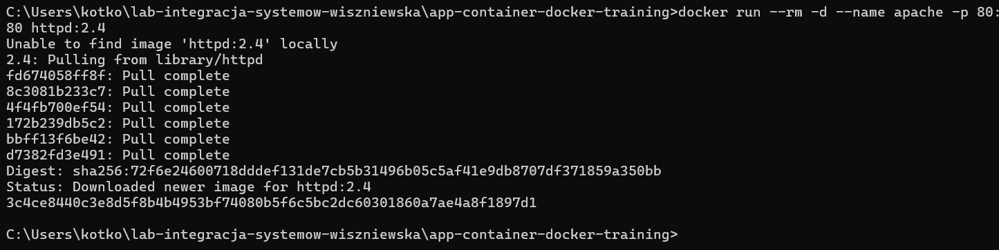

curl localhost to query the web server for the default page
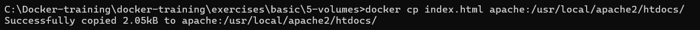

The first path is the source path, representing our new file on our host machine, and the second path our destination. apache is the name of the container we want to copy into, and /usr/local/apache2/htdocs/ is where the web server serves HTML from.

This container, for its lifetime, will continue to serve our new HTML file.

However, containers in Docker are, in practice, considered ephemeral. They can die unexpectedly, and in certain deployments, be removed without warning. If you're depending upon the container state for your application, you might lose important data when such containers die. This is especially a concern for applications like databases, which are supposed to be considered permanent datastores.

In the case of our HTTPD server, simply stopping the container will cause it to be autoremoved. We can bring another container back up in it's place, but it won't have our changes any more.

Managing volumes
Volumes in Docker are file stores, which sit independently of Docker containers. The function like Amazon Web Services' EBS volumes, and other mountable media like USB thumb drives. They can be created, deleted, and mounted on containers at specific locations within an image, like you would with mount command in Linux.
To list your volumes, run docker volume ls:
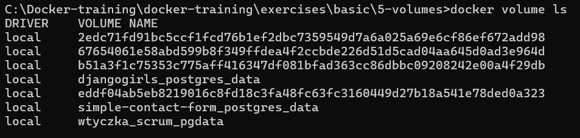

To create a new volume, run docker volume create and give it a volume name

```bash
$ docker volume create myvolume
myvolume
$ docker volume ls
DRIVER              VOLUME NAME
local               myvolume
```

To remove a volume, run docker volume rm and give it the volume name.

```bash
$ docker volume rm myvolume
myvolume
$ docker volume ls
DRIVER              VOLUME NAME
$
```

Mounting volumes on containers
First create a new volume named httpd_htdocs:
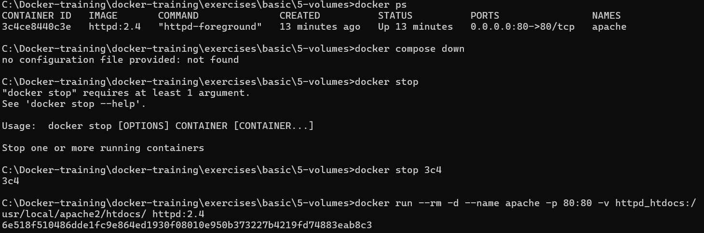


Then once again start httpd with the same run command as last time. This time, however, we can curl and see our file changes are still there from before.
We can take this volume and mount it on any HTTPD container now, which gives us flexibility in swapping out our container for newer versions without losing our data, if we wish.

Mounting host directories on containers
As an alternative to using volumes, if you have a directory on your host machine you'd like to use like a volume, you can mount those too. This is technique is useful in development environments, where you might want to mount your local repo onto a Docker image, and actively modify the contents of a Docker container without rebuilding or copying files to it.
The -v flag to accomplish this is almost identical to the previous one. Simply specify an absolute path to a local directory instead. In our case, we'll pass . to specify the 5-volumes directory in this repo, which conveniently contains a modified version of the HTML file.
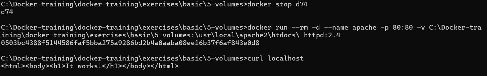

With the host directory mount in place, modify the index.html file in this directory with whatever message you like, then save the file and re-run curl.
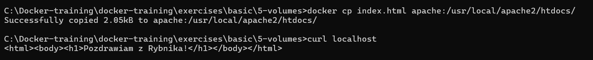

Exercise 6: Networking

In this exercise, I'll learn to work with Docker networks, and interconnect containers.

To accomplish this, I'll setup two Postgres databases, and query between them.
Docker defines networks, which groups containers for interoperability and DNS functions.

To list networks, run docker network ls:
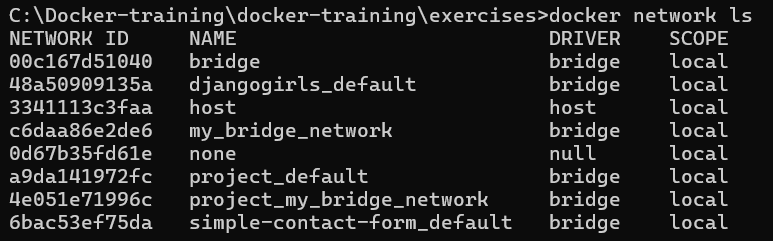
There are 3 default networks: bridge, host, and none listed here. Any other custom networks will also be listed here. The host and none networks are not important for this exercise, but bridge is of interest.
The default bridge network
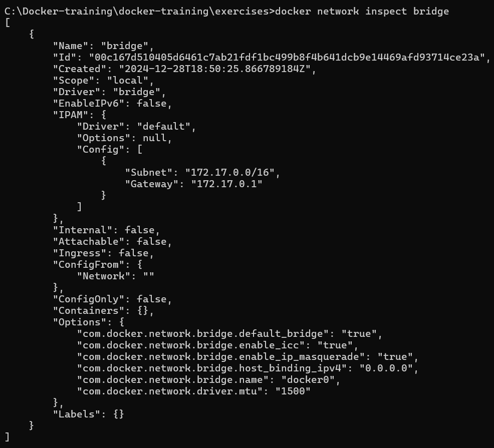
All new containers, if given no other configuration, will be automatically added the bridge network. This network acts as a pass through to your host's ethernet, so your Docker containers can access the internet.

There's some miscellaneous information about the network, but notice the "Containers": {} entry. You can see any containers that are currently connected to the network here.

```bash
C:\Docker-training\docker-training\exercises>docker run --rm -d --name dummy wisienkaa/ping:1.0
f3df44dbe4c602c149667bdbb26f14e071a52bf3f217486349a591e20afe0ea6
```

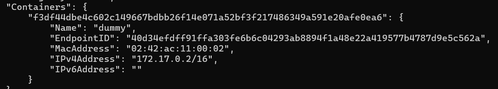
You can see the container was added to the default network. Now let's add another ping container, and set it to ping our first
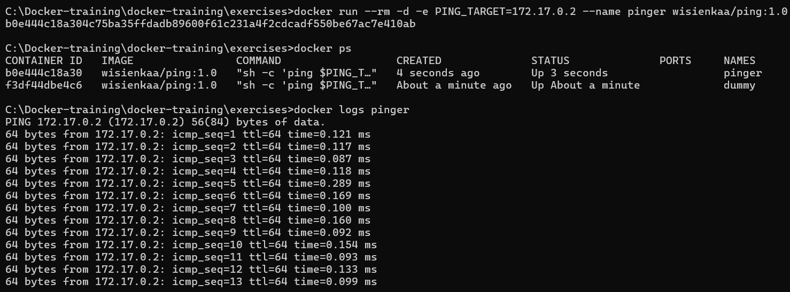
While IP address does work, it's very cumbersome and prone to error if addresses change. It would be better to use a hostname, specifically the container name dummy, to always resolve to the correct container.

Running ping with the dummy as the target:
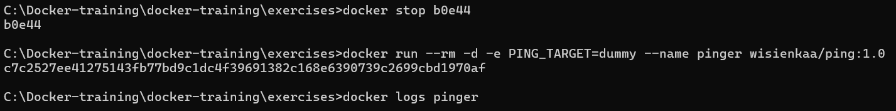

...results in failure. The host name couldn't be resolved, thus causing the command to error and the container exit and autoremove.

The default bridge network will not automatically allow you to network containers by container name. We can, however, easily accomplish host resolution using a custom network.

Managing custom networks
To create a new network, use the docker network create command and provide it a network name.
To remove networks, run docker network rm and provide it the network name.
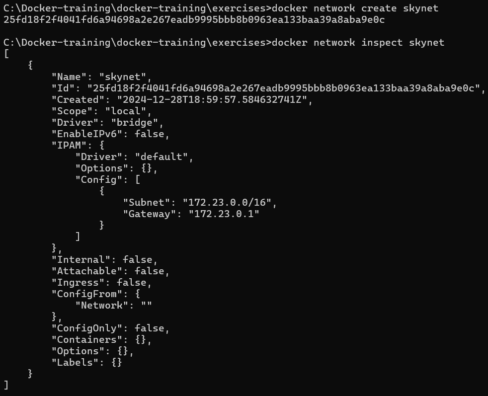

Adding containers to a network
Let's rerun the ping container, this time assigning it a network:
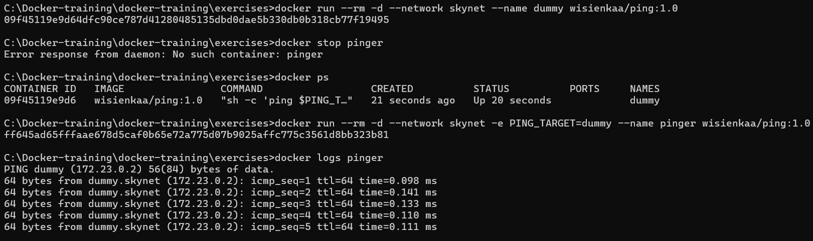

Notice this time the host name resolves successfully. This is Docker's Embedded DNS in action. It's most useful when orchestrating multiple containers in a single application, such as a web server, database, and cache. Instead of using IP addresses, you can define each of the respective connection strings using container names to leverage DNS resolution.

Connecting between containers in a network
We can resolve host names and ping, but this isn't the same as connecting with TCP/UDP between containers.

Let's setup two postgres databases to connect to one another: a widget database, and gadget database.

Start each of the databases and add them to the network:
By default, port 5432 is blocked and inaccessible. However, by adding -p 5432, we are permitting other containers to access it through port 5432, the default Postgres port.

```bash
$ docker run --rm -d --name widgetdb --network skynet -p 5432 postgres
7f0248e3c0f4f03159ef966fd9767a4c7e3412801f8b0445cebb933d1e84e020
$ docker run --rm -d --name gadgetdb --network skynet -p 5432 postgres
8dc66701837c695728abb9046db71924112a9b8f2f1e096094ab5b5d631e2f73
$ docker ps
CONTAINER ID        IMAGE               COMMAND                  CREATED             STATUS              PORTS                     NAMES
8dc66701837c        postgres            "docker-entrypoint..."   11 seconds ago      Up 10 seconds       0.0.0.0:32769->5432/tcp   gadgetdb
7f0248e3c0f4        postgres            "docker-entrypoint..."   40 seconds ago      Up 39 seconds       0.0.0.0:32768->5432/tcp   widgetdb
$
```

Now that they're running, start a shell session in the widgetdb using docker exec:

```bash
$ docker exec -it widgetdb /bin/bash
root@7f0248e3c0f4:/#
```

You can then connect to the local database using psql. (End the psql session by entering \q.)

```bash
root@7f0248e3c0f4:/# psql -U postgres
psql (9.6.2)
Type "help" for help.

postgres=# \q
root@7f0248e3c0f4:/#
```

Or to the gadget database by referring to it by name:

```bash
root@7f0248e3c0f4:/# psql -U postgres -h gadgetdb
psql (9.6.2)
Type "help" for help.

postgres=# \q
root@7f0248e3c0f4:/#
```

Binding ports to the host
Sometimes its useful to access an application running in a Docker container directly, as if it were running on your host machine.

To this end, you can bind ports from a container to a port on your host machine. To do this, the altered command from our previous Postgres example would look like:

```bash
docker run --rm -d --name widgetdb --network skynet -p 5432:5432 postgres
```

The -p flag given <host port>:<container port> does this mapping, making the server available as localhost:5432:

It's important to keep in mind that you can only bind one application to a host port at a time. If you try to start any applications on your host machine, or other Docker containers that want to bind to a port already in use, they will fail to do so.
END OF EXERCISE 6
