Exercise 1: Running containers

```bash
docker images
```


```bash
docker search <keyword>
```

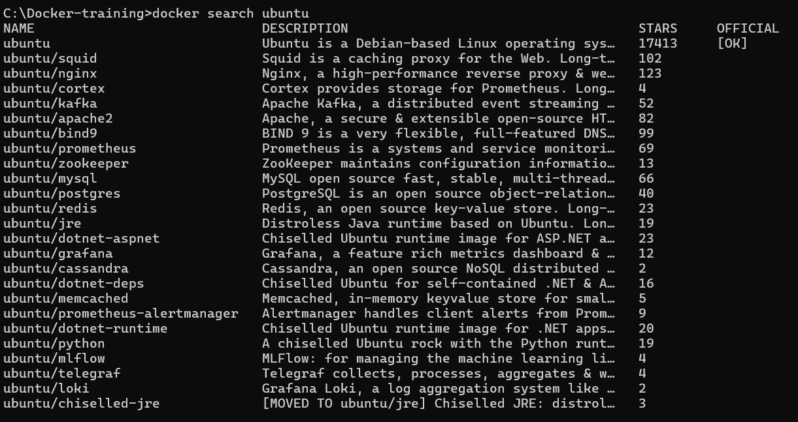

Run docker pull ubuntu:16.04 to pull an image of Ubuntu 16.04 from DockerHub.

```bash
docker pull ubuntu:16.04
```

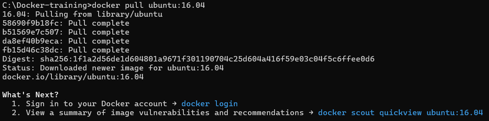

```bash
docker rmi cadfd9b26c33
```

Let's do a very simple example. Run docker run ubuntu:16.04 /bin/echo 'Hello world!'

```bash
docker run ubuntu:16.04 /bin/echo 'Hello world!'
```

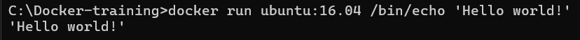

The ps command doesn't show stopped containers by default, add the -a flag.

```bash
docker ps -a
```

```bash
docker run ubuntu:16.04 /bin/bash
```

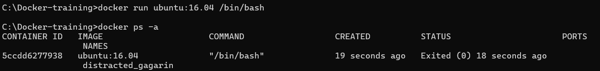

Instead, let's add the -it flags, which tells Docker to run the command interactively with your terminal.

```bash
$ docker run -it ubuntu:16.04 /bin/bash
```

Instead, let's add the -it flags, which tells Docker to run the command interactively with your terminal.

```bash
$ docker run -it ubuntu:16.04 /bin/bash
$ pwd
```

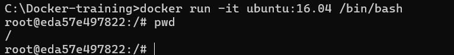

By adding the -d flag, we can run in detached mode, meaning the container will continue to run as long as the command is, but it won't print the output.

```bash
$ docker run -d ubuntu:16.04 /bin/sleep 3600
```

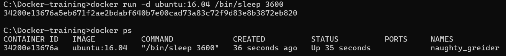

There is another command, called docker exec. docker exec runs a command within a container that is already running. It works exactly like docker run, except instead of taking an image ID, it takes a container ID.
This makes the docker exec command useful for tailing logs, or "SSHing" into an active container.

```bash
$ docker exec -it 342 /bin/bash
```

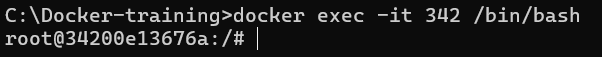

Let's list the running processes:

```bash
$ docker exec -it 342 /bin/bash
```


Stoping container

```bash
$ docker stop 342
```

Removing containers
To remove this we can use the docker rm command which removes stopped containers.

```bash
$ docker rm 342
```

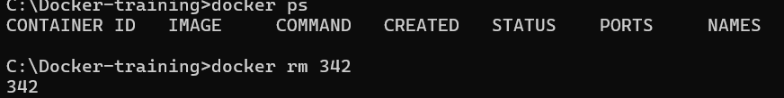

A nice shortcut for removing all containers from your system is docker rm $(docker ps -a -q)
It can be tedious to remove old containers each time after you run them. To address this, Docker also allows you to specify the --rm flag to the docker run command, which will remove the container after it exits.

```bash
$ docker run --rm ubuntu:16.04 /bin/echo 'Hello and goodbye!'
Hello and goodbye!
$ docker ps -a
CONTAINER ID        IMAGE               COMMAND             CREATED             STATUS              PORTS               NAMES
$
```

Exercise 2: Changing images
First start the container with /bin/bash:
Try running ping in the terminal.

```bash
$ C:\Docker-training> docker run -it ubuntu:16.04 /bin/bash
root@8b559ea51a87:/# ping google.com
bash: ping: command not found
root@8b559ea51a87:/#
```

The command doesn't exist. The Ubuntu image for Docker only has the bare minimum of software installed to operate the container. That's okay though: we can install the ping command.

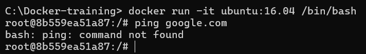

In Debian-based Linux environments (such as Ubuntu), you can install new software using the apt package manager. For those who have experience with Macs, this program is the equivalent of homebrew.
By default, to reduce the image size, the Ubuntu image doesn't have a list of the available software packages. We need to update the list of available software:

```bash
$ apt-get update
```


Call apt-get install iputils-ping to install the package containing ping

```bash
$ apt-get install iputils-ping
```

Ping your favorite website. When you've seen enough, Ctrl+C to interrupt, then exit the container.

```bash
$ ping google.com
```

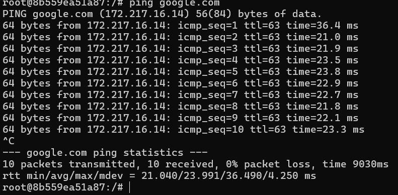

Committing changes
Pass the container ID, an author, commit message, and give it the name <DockerHub username>/ping:

```bash
$ docker commit -a 'David Elner' -m 'Added ping utility.' 786 delner/ping
docker images
```

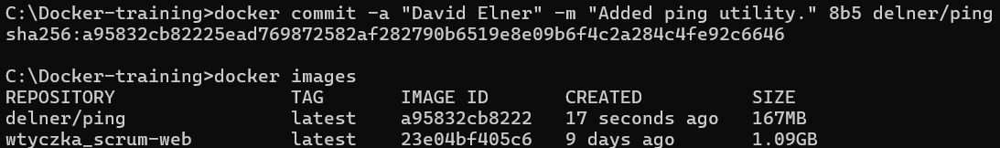

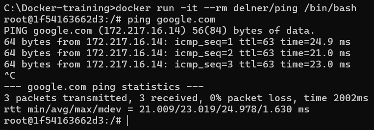
