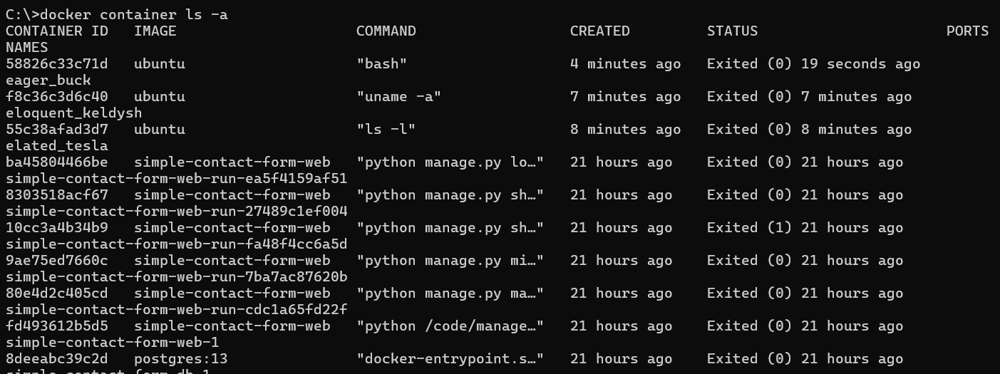

1. Uruchamianie pierwszego kontenera

```bash
docker run ubuntu ls -l
```


```bash
docker run ubunru uname -a
```


```bash
docker run --interactive --tty ubuntu bash
```


Wnętrze kontenera

```bash
root@58826c33c71d:/# echo "skni" > skni.txt
cat skni.txt
```


```bash
C:\>docker container ls -a
```


Podgląd na wszystkie kontenery

```bash
C:\>docker start 58826c
C:\>docker ps
```


Uruchomienie kontenera

```bash
C:\>docker exec 58826 cat skni.txt
```


Wykonanie komendy za pomocą metody exec w kontenerze

2. Obrazy w dockerze
   Struktura działania obrazu i kontenera:
   
   Możemy współdzielić warsty (container layer) pomiędzy różnymi obrazami. Docker zapewnia oszczędność miejsca, nie nadpisuje plików, ponieważ zawiera warstwe, która ma informacje o plikach, które zostały zmienione.

Tworzenie nowej warstwy obrazu:

```bash
C:\>docker commit 588 skni_img
```


Sprawdzenie czy obraz został utworzony

```bash
docker image ls
```


```bash
C:\>docker history skni_img
```

Wszystkie warstwy jakie składają się na ten obraz


```bash
C:\>docker run -it skni_img bash
```

Postawienie nowego kontenera na podstawie pliku skni_img

```bash
root@8e98c4223dca:/# apt update && apt install vim
```

Instalowanie programu w kontenerze


Stworzenie nowego kontenera na podstawie poprzedniego z zainstalowanym vim


3. Docker Hub - repozytorium publicznych obrazów dockerowych
   

Pobranie systemu postgres (systemu baz danych)

```bash
C:\>docker pull postgres
```


```bash
docker push skni_img
```

Aby wykonać powyższą komendę trzeba być zalogowanym na docker.hub. Jest to wrzucanie własnych obrazów na publiczne repozytorium.

```bash
docker login
```

4. Kopiowanie plików i ich edycja

```bash
C:\>docker cp eager_buck:/skni.txt .
```

Kopiowanie plisku z kontenera do dysku C


```bash
C:\>docker cp skni.txt eager_buck:/
```

Przesłanie pliku do kontenera


5. Dockerfile - tagowanie

```bash
docker build --tag mojvim .

docker --tag mojvim:latest mojvim:2.0 .

docker --tag mojvim:ubuntu19 .
```

docker build --tag mojvim .
Opis: Ta komenda buduje obraz Docker z bieżącego katalogu (.) i nadaje mu tag mojvim.
Szczegóły: Proces budowania obrazu wykorzystuje plik Dockerfile znajdujący się w bieżącym katalogu. Po zakończeniu budowy obraz jest identyfikowany przez tag mojvim.

docker --tag mojvim:latest mojvim:2.0 .
Opis: Ta komenda buduje obraz Docker z bieżącego katalogu (.) i nadaje mu dwa tagi: mojvim:latest i mojvim:2.0.
Szczegóły: Podczas budowania obrazu z pliku Dockerfile w bieżącym katalogu, obraz jest oznaczany jako mojvim:latest oraz mojvim:2.0, co pozwala na łatwe zarządzanie różnymi wersjami obrazu.

docker --tag mojvim:ubuntu19 .
Opis: Ta komenda buduje obraz Docker z bieżącego katalogu (.) i nadaje mu tag mojvim:ubuntu19.
Szczegóły: Podobnie jak w poprzednich przypadkach, obraz jest tworzony z pliku Dockerfile w bieżącym katalogu i oznaczany jako mojvim:ubuntu19, co sugeruje, że obraz może być oparty na Ubuntu 19.

6. Build Context

```bash
docker build .

echo "asd" > skni.txt

docker build -f .. /Dockerfile .


```

docker build .
Opis:Docker do zbudowania obrazu potrzebuje kontekstu, czyli jest to katalog do którego będziemy się odnosić w Dockerfile

docker build -f .. /Dockerfile .
Opis:Czerpie kontekst z innego katalogu w podanej scieżce

7. Konteneryzacja aplikacji konsolowej i webowej

Konteneryzacja aplikacji konsolowej polega na umieszczeniu aplikacji działającej w trybie tekstowym (CLI) w kontenerze. Pozwala to na uruchamianie jej w spójny sposób na różnych maszynach.

```bash
# Wybierz obraz bazowy z Pythonem
FROM python:3.8-slim

# Skopiuj pliki aplikacji do katalogu /app w kontenerze
COPY . /app

# Ustaw katalog roboczy
WORKDIR /app

# Zainstaluj zależności
RUN pip install -r requirements.txt

# Ustal domyślną komendę uruchamiania aplikacji
CMD ["python", "app.py"]
```

Konteneryzacja aplikacji webowej polega na umieszczeniu aplikacji serwerowej (np. webowej) w kontenerze. Dzięki temu aplikacja może być łatwo wdrożona i uruchomiona w różnych środowiskach.

8. Polecenia COPY, ADD i WORKDIR
   Polecenie ADD kopiuje pliki i katalogi z lokalnego systemu plików lub zdalnych URL do systemu plików kontenera.

```bash
ADD <źródło>... <katalog docelowy>
```

Polecenie COPY kopiuje pliki i katalogi z lokalnego systemu plików do systemu plików kontenera. Jest bardziej restrykcyjne niż ADD i nie obsługuje zdalnych URL ani automatycznego rozpakowywania archiwów tar.

```bash
COPY <źródło>... <katalog docelowy>
```

Polecenie WORKDIR ustawia katalog roboczy dla kolejnych instrukcji w Dockerfile oraz dla domyślnego katalogu roboczego po uruchomieniu kontenera.

```bash
WORKDIR /app
COPY moje_pliki .  # Kopiuje pliki do /app
RUN ls -l          # Wykonuje polecenie `ls -l` w katalogu /app
```

9. EntryPoint a CMD
   CMD: formy shell i exec
   Polecenie CMD określa domyślną komendę, która ma być uruchomiona, gdy kontener startuje. Występuje w dwóch formach:

Shell form (forma powłoki):

Komenda jest uruchamiana przez powłokę (/bin/sh -c na Linuxie).

```bash
CMD echo "Hello, World!"
/bin/sh -c "echo Hello, World!"
```

Exec form (forma exec):

Komenda jest uruchamiana bezpośrednio jako proces.

```bash
CMD ["echo", "Hello, World!"]
echo "Hello, World!"
```

Komentarze w Dockerfile są oznaczane znakiem #

CMD vs docker run
CMD definiuje domyślną komendę uruchamianą podczas startu kontenera.
docker run pozwala na nadpisanie komendy zdefiniowanej przez CMD.
Nadpisanie komendy:

```bash
docker run my_python_app python other_script.py
```

ENTRYPOINT definiuje komendę, która będzie uruchomiona i nie może być nadpisana przez docker run, chyba że użyje się flagi --entrypoint.
Przykład Dockerfile:

```bash
FROM python:3.8-slim
WORKDIR /app
COPY . .
RUN pip install -r requirements.txt
ENTRYPOINT ["python"]
CMD ["app.py"]


docker run my_python_app
```

Współpraca ENTRYPOINT i CMD
ENTRYPOINT i CMD mogą być używane razem. CMD dostarcza domyślne argumenty dla ENTRYPOINT.
Dockerfile:

```bash
FROM ubuntu
ENTRYPOINT ["top", "-b"]
CMD ["-c"]
```

Nadpisywanie ENTRYPOINT w docker run
ENTRYPOINT może być nadpisane przy użyciu flagi --entrypoint podczas uruchamiania kontenera.
Dockerfile:

```bash
FROM python:3.8-slim
WORKDIR /app
COPY . .
RUN pip install -r requirements.txt
ENTRYPOINT ["python"]
CMD ["app.py"]
```

Uruchomienie kontenera z nadpisanym ENTRYPOINT:

```bash
docker run --entrypoint /bin/bash my_python_app
```

10. Volumes zarządzane przez dockera
    Są to wirtualne dyski, a tworzy się je tak:

```bash
docker volume create moj-volume
docker volume ls
docker volume rm moj-volume
```

Dockerfile:

```bash
FROM ubuntu
WORKDIR /katalog
CMD ls -al && echo "test" > file.txt && ls -al
```

Zbudowanie obrazu:

```bash
docker build -f vol.Dockerfile -t vol vol_test
docker run vol_test
```

Używamy Volume by przechowywać dane pomiędzy różnymi kontenerami:
Używamy volumenu i podpiąc go wewnątrz kontenera pod /katalog

```bash
docker run --volume moj-volume:/katalog
```

Volumeny są niezależne od kontenerów.

```bash
docker run --volume /katalof vol-test
```

Tworzy gotowy volumen i dodaje do kontenera, nadaje mu losowe id, nie są przeznaczone by ręcznie w nich pracować
Jeżeli dwa kontenery będą pracować z tym samym volumenem to nic się nie stanie.
Podpinanie kontenera do plików lokalnych razem BIND MOUNT

```bash
docker run --volume "sciezka do katalogu" //c/Users/kotko/w/docker/s3/katalog:/katalog
```

Teraz mamy katalog i na komputerze lokalnie i w kontenerze
Monitorowanie na żywo zmian:

```bash
docker run ubuntu watch ls /app
```

11. Baza danych w kontenerze
    Wypisanie wszystkich zmiennych środowiskowych w kontenerze:

```bash
docker run ubuntu env
```

Przekazywanie ustawień do programu działającego w kontenerze:

```bash
docker run -e MOJA_ZMIENNA=ture ubuntu env
```

Uruchamianie bazy w kontenerze (konfiguracja z dockerhub)

```bash
docker run --name baza --detach postgres #kontener uruchamia się w tle
docker logs baza
docker rm baza #usuwanie konetnera baza
docker run --name baza --detach -e POSTGRES_ PASSWORD= haslo postgres
docker exec -it baza psql --username postgres #konsola bazy w dockerze

create table tabela();
select * from tabela;

docker stop baza
docker rm baza
```

```bash
docker run --name baza --detach -e POSTGRES PASSWORD=haslo volume dane_bazy:/var/lib/postgresql/data postgres
docker exec -it baza psql --username postgres #konsola bazy w dockerze

create table tabela();
docker stop baza
docker rm baza
drocker volume ls #pozostaje volume danej bazy

docker exec -it baza psql --username postgres #uruchomienie nowej instancji ale używając danych które używaliśmy przed chwilą
```

12. Docker inspect
    docker inspect to komenda w Dockerze, która służy do wyświetlania szczegółowych informacji o obiektach Docker, takich jak kontenery, obrazy, wolumeny lub sieci. Informacje są prezentowane w formacie JSON.

```bash
docker inspect my_container
```

Wynikowo daje to nam:

```bash
[
    {
        "Id": "8dfafdbc3a40",
        "Created": "2020-04-07T12:44:20.041Z",
        "Path": "/bin/sh",
        "Args": ["-c", "while true; do echo hello world; sleep 1; done"],
        "State": {
            "Status": "running",
            "Running": true,
            "Paused": false,
            "Restarting": false,
            "OOMKilled": false,
            "Dead": false,
            "Pid": 12345,
            "ExitCode": 0,
            "Error": "",
            "StartedAt": "2020-04-07T12:44:21.171Z",
            "FinishedAt": "0001-01-01T00:00:00Z"
        }, #dalsza część kodu...
    }
]
```

13. Docker Networks: wirtualne sieci w kontenerach
