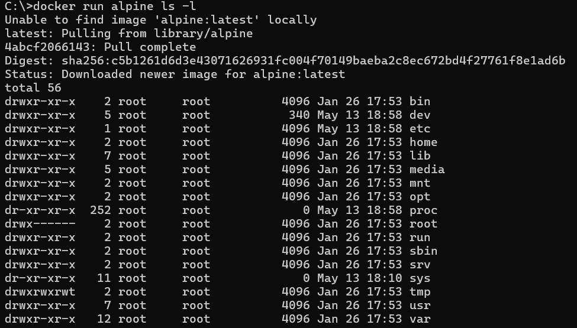

1. Uruchamianie pierwszego kontenera

```bash
docker run ubuntu ls -l
```


```bash
docker run ubunru uname -a
```


```bash
docker run --interactive --tty ubuntu bash
```


Wnętrze kontenera

```bash
root@58826c33c71d:/# echo "skni" > skni.txt
cat skni.txt
```


```bash
C:\>docker container ls -a
```


Podgląd na wszystkie kontenery

```bash
C:\>docker start 58826c
C:\>docker ps
```


Uruchomienie kontenera

```bash
C:\>docker exec 58826 cat skni.txt
```


Wykonanie komendy za pomocą metody exec w kontenerze

2. Obrazy w dockerze
   Struktura działania obrazu i kontenera:
   
   Możemy współdzielić warsty (container layer) pomiędzy różnymi obrazami. Docker zapewnia oszczędność miejsca, nie nadpisuje plików, ponieważ zawiera warstwe, która ma informacje o plikach, które zostały zmienione.

Tworzenie nowej warstwy obrazu:

```bash
C:\>docker commit 588 skni_img
```


Sprawdzenie czy obraz został utworzony

```bash
docker image ls
```


```bash
C:\>docker history skni_img
```

Wszystkie warstwy jakie składają się na ten obraz


```bash
C:\>docker run -it skni_img bash
```

Postawienie nowego kontenera na podstawie pliku skni_img

```bash
root@8e98c4223dca:/# apt update && apt install vim
```

Instalowanie programu w kontenerze


Stworzenie nowego kontenera na podstawie poprzedniego z zainstalowanym vim


3. Docker Hub - repozytorium publicznych obrazów dockerowych
   

Pobranie systemu postgres (systemu baz danych)

```bash
C:\>docker pull postgres
```


```bash
docker push skni_img
```

Aby wykonać powyższą komendę trzeba być zalogowanym na docker.hub. Jest to wrzucanie własnych obrazów na publiczne repozytorium.

```bash
docker login
```

4. Kopiowanie plików i ich edycja

```bash
C:\>docker cp eager_buck:/skni.txt .
```

Kopiowanie plisku z kontenera do dysku C


```bash
C:\>docker cp skni.txt eager_buck:/
```

Przesłanie pliku do kontenera

