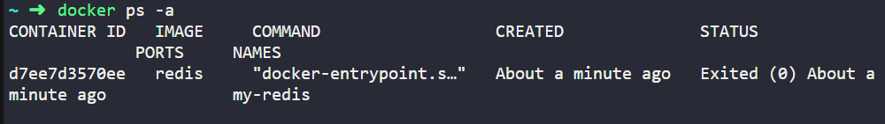

# Docker for Beginners with Hands-on Labs - Notatki z Kursu

## Why do we need Docker?

### Compatibility/Dependency

- Long setup time
- Different Dev/Test/Prod environments

Docker allows us to run each component in a separate container with their own libraries and dependencies on the same virtual machine. Containers are isolated environments that share the same OS kernel. Docker can run any flavor of OS on top of the container as long as they are based on the same kernel.

### Containers vs Virtual Machines (VMs)

| **Aspect**       | **Containers**                   | **Virtual Machines**               |
| ---------------- | -------------------------------- | ---------------------------------- |
| **Performance**  | Near-native performance          | Some performance overhead          |
| **Security**     | Less isolated, shared kernel     | Highly isolated, full OS           |
| **Startup Time** | Very fast (milliseconds)         | Slower (seconds to minutes)        |
| **Use Cases**    | Microservices, cloud-native apps | Legacy apps, multi-OS environments |


## Public Docker Registry - Docker Hub

Docker Hub is the default public registry for Docker. It contains images for a wide variety of applications and services.

## How to get started with Docker?

### Step 1: Identify your system

Choose your OS flavor (e.g., Ubuntu) and ensure that no other version of Docker is installed.

### Step 2: Install Docker

The easiest way to install Docker is using the convenience script:

```bash
curl -fsSL https://get.docker.com -o get-docker.sh
sudo sh get-docker.sh
```

Docker Knowledge Test
What does Docker primarily use to isolate application dependencies?

Answer: Containers
Which type of container does Docker utilize?

Answer: LXC (Linux Containers)
Which of the following are benefits of using Docker to simplify the setup of complex application stacks and address compatibility issues?

Answer:
Docker ensures that applications run the same regardless of where they are run.
Docker eliminates the need for virtual machines.
Docker containers are lightweight.
Which of the following platforms does Docker support?

Answer:
Linux
Windows
macOS
Which of the following is not a reason to use Docker for deploying applications?

Answer: It increases the size of applications.
How many main editions does Docker have?

Answer: 2 (Docker Community Edition (CE) and Docker Enterprise Edition (EE))
Which of the following is a key difference between the community and enterprise editions of Docker?

Answer: The enterprise edition offers additional features such as advanced management capabilities.
Twoja ocena
100%
Do zaliczenia wymagane jest co najmniej 80%. Zachowujemy najnowszy wynik.

# Moduł nr 2 - Notatki

## Uruchamianie kontenerów

Aby uruchomić kontener z obrazu, użyj polecenia:

```bash
docker run uruchamia kontener z obrazu.
```

    Jeśli obraz nie istnieje lokalnie, Docker pobiera go z Docker Hub (tylko za pierwszym razem).

Kolejne uruchomienia wykorzystują już pobrany obraz.
Zarządzanie kontenerami:

docker ps wyświetla listę uruchomionych kontenerów.

docker ps -a wyświetla wszystkie kontenery (aktywne i zakończone).

docker stop zatrzymuje działający kontener (użyj ID kontenera lub jego nazwy).

docker rm usuwa zatrzymany kontener.

Zarządzanie obrazami:

docker images pokazuje dostępne obrazy na hoście.

docker rmi usuwa obraz (należy najpierw zatrzymać i usunąć kontenery używające tego obrazu).

docker pull pobiera obraz bez jego uruchamiania.

Kontenery a maszyny wirtualne:

Kontenery uruchamiają specyficzny proces lub zadanie.

Po zakończeniu zadania kontener automatycznie się wyłącza.

Przykład: docker run ubuntu uruchamia kontener, który natychmiast się zatrzymuje, ponieważ nie ma żadnego procesu do uruchomienia.

Uruchamianie procesów wewnątrz kontenera:

Można uruchomić proces wewnątrz kontenera np. docker run ubuntu sleep 5 uruchamia kontener i proces sleep na 5 sekund.

docker exec pozwala uruchomić komendę w działającym kontenerze (np. docker exec <container-id> cat /etc/hosts wyświetla zawartość pliku /etc/hosts w kontenerze).

Uruchamianie aplikacji webowych:

docker run kodecloud/simpleweb-app uruchamia serwer webowy na porcie 8080.

Domyślnie uruchamia się w trybie "attached" – widzisz wyniki na konsoli.

Można uruchomić kontener w tle za pomocą opcji -d (tryb "detached").

Aby powrócić do kontenera działającego w tle, użyj docker attach.

Identyfikacja kontenerów:

Identyfikatory kontenerów mogą być skracane do pierwszych kilku znaków (np. docker attach a043d).

Uruchamianie kontenera Docker

Polecenie: docker run <nazwa-obrazu>

Zastosowanie: Uruchamia kontener z określonym obrazem.

Przykład:

Aby uruchomić CentOS:

Najpierw pobierz obraz: docker pull centos

Następnie uruchom: docker run centos

Źródło obrazów: Oficjalne obrazy można znaleźć na stronie Docker Hub.

Uruchamianie poleceń w kontenerze

Interaktywne logowanie: Użyj -it, aby uruchomić polecenie i zalogować się bezpośrednio.

Przykład: docker run -it centos bash (uruchamia powłokę bash w kontenerze).

Sprawdzanie systemu operacyjnego

Polecenie do weryfikacji systemu: cat /etc/\*release

Uruchamianie kontenerów w tle

Polecenie: docker run -d <nazwa-obrazu> <polecenie>

Przykład: docker run -d centos sleep 20 (uruchamia kontener CentOS, który śpi przez 20 sekund w tle).

Wyświetlanie wszystkich kontenerów (w tym zakończonych)

Polecenie: docker ps -a

Funkcja: Wyświetla wszystkie kontenery, w tym te, które zakończyły działanie.

Zatrzymywanie kontenera

Polecenie: docker stop <id lub nazwa-kontenera>

Przykład: docker stop serene_pasteur

Usuwanie kontenerów

Polecenie: docker rm <id lub nazwa-kontenera>

Zastosowanie: Oczyszcza zakończone kontenery, aby odzyskać miejsce na dysku.

Usuwanie wielu kontenerów: Można podać wiele identyfikatorów/nazw w jednym poleceniu (np. docker rm <id1> <id2>).

Wyświetlanie obrazów Docker

Polecenie: docker images

Funkcja: Wyświetla wszystkie dostępne lokalnie obrazy.

Usuwanie obrazów Docker

Polecenie: docker rmi <nazwa-obrazu>

Zastosowanie: Usuwa wskazane obrazy Docker.

Zależności: Nie można usunąć obrazu, jeśli kontenery są od niego zależne; najpierw należy usunąć kontenery.

Usuwanie obrazów

Polecenie: docker rmi <nazwa-obrazu>

Przykład: Aby usunąć obraz hello-world, wykonaj:

docker rmi hello-world

Stan: żadne kontenery nie są uruchomione przed próbą usunięcia obrazów.

Pobieranie obrazów Docker

Polecenie: docker pull <nazwa-obrazu>

Zastosowanie: Pobiera obraz z Docker Hub bez jego uruchamiania.

Przykład: Aby pobrać obraz Ubuntu:

docker pull ubuntu

Przechowywanie lokalne: Po pobraniu obraz będzie dostępny lokalnie, co można potwierdzić poleceniem docker images.

Uruchamianie kontenera w tle

Polecenie: docker run -d <nazwa-obrazu>

Przykład: Aby uruchomić kontener Ubuntu w tle przez 100 sekund:

docker run -d ubuntu sleep 100

    Polecenie: docker exec <id-kontenera> <polecenie>

Zastosowanie: Wykonuje polecenie wewnątrz już działającego kontenera.

Przykład: Aby sprawdzić wersję systemu operacyjnego w działającym kontenerze Ubuntu:

Najpierw zidentyfikuj id kontenera z docker ps.

Następnie uruchom: docker exec <id-kontenera> cat /etc/\*release

Funkcjonalność: To polecenie umożliwia interakcję z systemem plików i procesami wewnątrz kontenera.

## Hands-on Lab: Basic Docker Commands - ćwiczenia

https://kodekloud.com/pages/free-labs/docker/docker-basic-commands

What is the version of Docker Server Engine running on the Host?


How many containers are running on this host?


How many images are available on this host?


Run a container using the redis image


Stop the container you just created


How many containers are PRESENT on the host now?

Including both Running and Not Running ones


Wykonałam testy, wynik: 15/17

Zadanie na ocenę:

Which Docker command is used to list all running containers

docker ps

Pytanie 2

What does the 'docker rm' command do?

Removes a Docker container

Pytanie 3

Which of the following Docker commands are related to managing containers?

docker run
docker stop
Pytanie 4

What is the role of the 'docker pull' command?

To download a Docker image from a registry

Pytanie 5

What is the Docker command to remove a Docker container?

Please answer in all lowercase.

docker rm

Pytanie 6

What does the 'docker run' command do?

It runs a Docker container from an image

Pytanie 7

Which command would you use to run a command inside a running Docker container?

docker exec

Pytanie 8

Which of the following Docker commands can be used for managing Docker images?

docker pull

docker rmi

docker images

Pytanie 9

What Docker command is used to stop a running container? Please answer in all lowercase.

docker stop

Pytanie 10

Which of the following Docker commands require an image name or ID?

docker rmi
docker stop
​​​​​​​docker pull

# Moduł 3 - Docker Run

##ocker run i wersje obrazów
Aby uruchomić kontener z określoną wersją obrazu, używa się tagu:
z
Przykład: docker run redis:4.0 (uruchamia Redis w wersji 4.0).
W przypadku braku podania tagu, Docker domyślnie uruchomi najnowszą wersję (latest).
Informacje o dostępnych wersjach obrazów można znaleźć na Docker Hub.
Tryb interaktywny (-i) i terminal (-t)
Domyślnie Docker nie obsługuje wejścia użytkownika z terminala:
-i: Aktywuje tryb interaktywny, umożliwiając przekazywanie danych wejściowych (input).
-t: Tworzy pseudo-terminal, który pozwala na wyświetlanie komunikatów aplikacji (np. promptów).
Kombinacja -it pozwala na interaktywne korzystanie z kontenera oraz jego terminala.
Mapowanie portów (port publishing)
Port mapping umożliwia dostęp do aplikacji uruchomionej w kontenerze z zewnątrz:
Przykład: docker run -P -p 80:5000 (mapuje port 80 hosta na port 5000 w kontenerze).
IP kontenera (np. 172.17.0.2) jest dostępne tylko wewnątrz Docker hosta.
Aby aplikacja była dostępna na zewnątrz, należy użyć IP hosta oraz odpowiednio zmapowanego portu (np. http://192.168.15:80).
Uruchamianie wielu aplikacji i instancji
Można uruchamiać wiele instancji aplikacji, przypisując im różne porty na hostcie:
Przykład: MYSQL może działać na portach 3306 i 8306 w różnych instancjach.
Persystencja danych
Dane przechowywane w kontenerze znikają po jego usunięciu.
Aby utrwalić dane, można mapować katalog z hosta na katalog w kontenerze:
Przykład: docker run -v /opt/datadir:/var/lib/mysql (mapuje katalog hosta do katalogu w kontenerze).
W ten sposób dane zapisane w zewnętrznym katalogu pozostają dostępne nawet po usunięciu kontenera.
Docker inspect
docker inspect pozwala uzyskać szczegółowe informacje o kontenerze w formacie JSON:
Informacje takie jak: stan, ustawienia sieci, zamontowane wolumeny, dane konfiguracyjne itp.
Podgląd logów kontenera
Aby zobaczyć logi kontenera uruchomionego w tle (detached mode), używa się polecenia:
docker logs <container-id> (wyświetla logi z kontenera).
Tryby uruchamiania kontenerów
Uruchamianie kontenera w tle:
Domyślnie kontener działa w trybie „przywiązanym” do terminala. Aby działał w tle, używa się opcji -d (detached mode): docker run -d ubuntu sleep 1500.
Kontener można przywrócić do trybu "przywiązanego", używając polecenia docker attach <ID_kontenera>.
Zarządzanie kontenerami:
Polecenie docker stop <ID_kontenera> zatrzymuje kontener.
docker ps wyświetla kontenery uruchomione w trybie detached, podając pierwsze znaki ich ID.
Przykład uruchomienia aplikacji w Docker
Uruchamianie innych obrazów, np. Jenkins:
Jenkins można uruchomić jako kontener za pomocą docker run jenkins.
Aby uzyskać dostęp do aplikacji webowej (np. Jenkins), należy zmapować port kontenera na port hosta (np. docker run -p 8080:8080 jenkins).
Dostęp do aplikacji w kontenerze:
Można uzyskać dostęp do aplikacji webowej wewnątrz hosta za pomocą wewnętrznego adresu IP kontenera, np. docker inspect wyświetla szczegóły, w tym IP kontenera.
Można zmapować port kontenera na zewnętrzny port hosta, aby uzyskać dostęp z zewnątrz, np. przez przeglądarkę: docker run -p 8080:8080 jenkins.
Testy praktyczne i teoretyczne
Use the link provided to access the lab and delve into the hands-on practice of the topic you just learned.  
https://kodekloud.com/pages/free-labs/docker/docker-run

## Zadanie na ocenę: Docker run

1. Which command would you use to run a Docker container with a specific image tag?
   docker run imagename:tag
2. If you want to check the logs of a running Docker container, what command would you use?
   Please answer in all lowercase.
   Docker logs
3. Which of the following commands are used to manage Docker containers?
   Docker stop
   Docker restart
   Docker start
4. What is the result of running the 'docker run' command without specifying an image tag?
   Docker will run the container with 'latest' tag
5. Which command allows you to run a Docker container in the detached mode?
   docker run -d <image_name>
6. What command is used to view the logs of a Docker container?
   Please answer in all lowercase.
   docker logs <container_id>
7. Which of the following are reasons why it's important to map volumes for data persistence in Docker containers?
   Volumes allow data to be shared between containers
   Volumes can be used to store sensitive data outside of the container
   Volumes persist data even when the container is deleted
8. If you want to run a Docker container with a specific command, which of the following options should be used with the 'docker run' command?
   --execute
9. What is the purpose of the '-d' option in the 'docker run' command?
   TO run the Docker container in the background
10. Which of the following options are TRUE regarding data persistence in Docker?
    Data in a Docker container is lost when the container is removed.
    Volumes are used in Docker to persist data.
    Data in a Docker container can be accessed even after the container is stopped.
    Twoja ocena
    Do zaliczenia wymagane jest co najmniej 80%. Zachowujemy najnowszy wynik.90%

# Moduł 4 - Docker Images - podsumowanie modułu

Dlaczego warto jest używać obrazów w Dockerze?
Jeśli komponent lub usługa nie jest dostępna na Docker Hub, warto umieć stworzyć własny obraz.
Obrazy ułatwiają wdrażanie i dystrybucję aplikacji w zespole.
Konteneryzowanei aplikacji:
Podstawowym systemem operacyjnym powinien być Ubuntu, czyli tak jak na naszych maszynach
Wykonanie polecenia apt-get update, aby zaktualizować repozytoria pakietów.
Zainstalowanie wymaganych pakietów (np. Python, Flask) za pomocą apt-get i pip.
Skopiowanie kodu źródłowego do odpowiedniego katalogu, np. /opt/app.py.
Wykonanie komendy flask run na porcie 5000.
Takim sposobem uruchomiłam swoją pierwszą aplikację w kkontenerze.
Tworzenie pliku Dockerfile (zawiera instrukcje do budowania obrazu Docker)
RUN apt-get update
RUN apt-get install -y python python-pip
RUN pip install flask
kopwiowanie kodu źródłowego: COPY app.py /opt/app.py
Zdefiniowanie komendy, która uruchomi aplikację Flask, gdy kontener zostanie uruchomiony: ENTRYPOINT ["python", "/opt/app.py"
Budowanie obrazu Docker
budowa: docker build -t my_simple_web_app .
Warto zaznaczyc, że Docker buduje obraz w warstwach i cache'uje każdą z nich. W przypadku niepowodzenia jakiejś warstwy lub aktualizacji, Docker odbudowuje tylko te warstwy, co przyspiesza budowanie.
Uruchomienie kontenera
docker run -p 5000:5000 my_simple_web_app
Wrzucenie obrazu na docker huba
docker build -t Wisienkaa66/my_simple_web_app .
docker login
docker push Wisienkaa66/my_simple_web_app
Po wrzuceniu obrazu na docker hub każdy użytkownik, np. czlonek zespołu, może go uzyc u siebie, w tym przypadku pobrac i uruchomić:
docker pull Wisienkaa66/my_simple_web_app
docker run -p 5000:5000 Wisienkaa66/my_simple_web_app
Następnie wykonałam test
Use the link provided to access the lab and delve into the hands-on practice of the topic you just learned. https://kodekloud.com/pages/free-labs/docker/docker-images
Konfiguracja zmiennych środowiskowych w Dockerze
Problem: Zmiana koloru tła wymaga modyfikacji kodu aplikacji.
Rozwiązanie: Użycie zmiennej środowiskowej APP_COLOR, co umożliwia łatwe zmienianie koloru bez edytowania kodu.
najpierw uruchamiam apkę docker run
nastepnie mogę zmienić kolor tła apki komendą docker run -e APP_COLOR=pink simple-webapp-color
aby sprawdzic zmienne srtodowiskowe uzywam docker inspect i w sekcji Config mam zmienne srodowiskowe
Wykonałam kolejny test:
Use the link provided to access the lab and delve into the hands-on practice of the topic you just learned. https://kodekloud.com/pages/free-labs/docker/docker-env-vars

Komendy, Argumenty i Punkty Wejścia w Dockerze

Kontenery nie działają jak maszyny wirtualne, ale uruchamiają konkretne zadania, które kończą swoje działanie po zakończeniu procesu.

Domyślnym procesem w kontenerze Ubuntu jest Bash, który wymaga terminala do działania. Bez terminala Bash kończy działanie, co prowadzi do wyjścia kontenera.

Aby uruchomić kontener z innym procesem, można dodać polecenie do docker run np. docker run ubuntu sleep 5

Przykład użycia polecenia sleep w nowym obrazie jako Ubuntu sleeper

docker run ubuntu_sleeper 10

Punkt Wejścia (ENTRYPOINT) pozwala na zdefiniowanie programu uruchamianego przy starcie kontenera, a parametry przekazane z linii poleceń zostaną do niego dołączone.

CMD zastępuje całkowicie przekazane parametry, podczas gdy ENTRYPOINT je dołącza.
Użycie obu instrukcji w formacie JSON umożliwia ustawienie wartości domyślnej dla polecenia, jeśli nie zostanie określona żadna wartość przy uruchomieniu.
Istnieje możliwość nadpisania punktu wejścia podczas uruchamiania kontenera przy pomocy opcji --entrypoint. np. docker run --entrypoint sleep2.0 ubuntu_sleeper 10
Wykonałam kolejny test
Use the link provided to access the lab and delve into the hands-on practice of the topic you just learned. https://kodekloud.com/pages/free-labs/docker/docker-cmd-entrypoint
Test teoretyczny
What is the purpose of setting environment variables in a Docker container?

To configure runtime behavior of the container
How can we modify the behavior of a Docker container?
By running the container with different arguments
What command is used to run a Docker container from an image? Please answer in all lowercase.
Odpowiedź: docker run
What steps are involved in deploying a Docker container from a custom Docker image?
Write a Dockerfile
Build the Docker image from the Dockerfile
Tag the Docker image with the account name
Run the Docker container from the Docker image
Push the Docker image to Docker Hub
What command is used to build a Docker image from a Dockerfile? Please answer in all lowercase.
Odp: docker build
What is the Dockerfile used for in Docker?
Odp: To build custom Docker images
Which of the following statements about Docker images and Docker containers are true?
Docker images can be built from Dockerfiles
A Docker image is a lightweight, standalone executable package
A Docker container is a running instance of a Docker image
Which of the following are valid reasons for creating custom Docker images?
To include application-specific configuration
To create a reproducible environment
To pre-install software dependencies
What happens when you try to run a Docker container from an image that isn't available locally?
Docker will automatically pull the image from Docker Hub
Why is it important to tag a Docker image with an account name before pushing it to Docker Hub?
To ensure the image is stored under the right account on Docker Hub
Ocena wraz z poprawionymi blędami
Do zaliczenia wymagane jest co najmniej 80%. Zachowujemy najnowszy wynik.
Moja ocena: 80%
Poprawione błędy
Running the container with different arguments can modify the behavior, but this isn't the primary method used.

Writing a Dockerfile is the first step in creating a custom Docker image, but it's not part of deploying a Docker container.

While pushing the Docker image to Docker Hub can be done as part of the deployment process, it's not a necessary step in deploying a Docker container.

# Moduł 5 - Docker Compose - podsumowanie modułu

Docker Compose: Umożliwia uruchamianie złożonych aplikacji z wieloma usługami za pomocą pliku konfiguracyjnego w formacie YAML (docker-compose.yml).
Przykładowa aplikacja do głosowania składa się z:
Voting App: Aplikacja webowa napisana w Pythonie, która zbiera głosy.
Redis: Baza danych w pamięci do przechowywania głosów.
Worker: Aplikacja .NET, która przetwarza głosy i aktualizuje bazę danych.
PostgreSQL: Baza danych, która przechowuje wyniki głosowania.
Result App: Aplikacja w Node.js, wyświetlająca wyniki głosowania.
Linki między kontenerami: Umożliwiają komunikację między różnymi kontenerami (np. Voting App z Redis). Należy jednak pamiętać, że użycie linków jest przestarzałe w nowszych wersjach Dockera.
W pliku Docker Compose definiuje się usługi, obrazy, porty oraz linki między kontenerami.
Zmiany w architekturze mogą obejmować tworzenie dedykowanych sieci do zarządzania ruchem (np. front-end i back-end).
Struktura mojego pliku:
services:
redis:
image: redis
networks: - backend
db:
image: postgres
networks: - backend
voting-app:
build: ./vote
ports: - "5000:80"
networks: - frontend - backend
result-app:
build: ./result
ports: - "5001:80"
networks: - frontend - backend
networks:
frontend:
backend:

Wersje Docker Compose
Wersja 1: Ograniczona funkcjonalność (brak dedykowanych sieci).
Wersja 2: Wprowadzenie dedykowanych sieci i zależności (np. depends_on).
Wersja 3: Obsługuje Docker Swarm i dodatkowe opcje.
Docker Compose-Demo-1-Voting-app
Kod i Dockerfile:
Aplikacja głosowania korzysta z Redis do przechowywania głosów.
Worker łączy się z Redis i Postgres, przetwarzając głosy i aktualizując bazę danych.
Result App łączy się z Postgres, aby wyświetlać wyniki.
Uruchamianie Aplikacji za pomocą Docker
W celu uruchomienia aplikacji lokalnie, najpierw należy zbudować obrazy dla komponentów aplikacji (Voting App, Worker, Result App).
Wykorzystałam polecenie docker build, aby stworzyć obrazy z Dockerfile.
Najpierw uruchomiłam kontener Redis, a następnie Voting App, używając polecenia docker run.
Aby kontenery mogły się komunikować, zastosowałam opcję --link podczas uruchamiania kontenerów.
Aplikacja Voting App mogła teraz poprawnie łączyć się z Redis.
Następnie uruchomiłam kontener Postgres, a potem Worker, który przetwarzał głosy. Worker został połączony zarówno z Redis, jak i Postgres.
Na końcu uruchomiono Result App, aby wyświetlić wyniki głosowania.
Użytkownicy mogli oddawać głosy, a wyniki były natychmiast aktualizowane na stronie wyników dzięki redisowi
Dzięki kursowi mogłam za pomocą Dockera uruchomić złożoną aplikację składającą się z wielu komponentów ucząc się o znaczeniu obrazów Docker file i poznać komunikację między różnymi kontenerami.
Część 2
W poprzedniej części użylam podstawowej wersji pliku docker-compose, która była prostsza, ale nie wspierała wielu zaawansowanych funkcji.
W drugiej części plik zostanie zaktualizowany do wersji 3, co umożliwia lepsze zarządzanie kontenerami i ich sieciami.
Na początku pliku należy określić wersję:
yaml
version: '3'

Przy użyciu wersji 3, Docker Compose automatycznie tworzy sieć dla kontenerów, umożliwiając im wzajemną komunikację przy użyciu nazw usług (np. redis, db).
Zlikwidowanie sekcji links: Wersja 3 nie wymaga ręcznego linkowania, co upraszcza plik.
Po uruchomieniu komendy docker-compose up pojawił się błąd: "No such device or address" oraz "Waiting for db", co wskazywało na problemy z dostępem do bazy danych Postgres.
W nowej wersji obrazu Postgres konieczne jest podanie domyślnego hasła dla superuser poprzez zmienną środowiskową POSTGRES_PASSWORD.
Aby rozwiązać problem, dodano zmienną środowiskową POSTGRES_PASSWORD w sekcji db kontenera w pliku docker-compose.yml.
Użytkownik i hasło dla bazy danych muszą być zgodne z tymi, które są używane przez aplikacje worker i result.
Po wprowadzeniu odpowiednich poprawek i ponownym uruchomieniu kontenerów, wszystko zostało pomyślnie uruchomione.
Aplikacja głosowania dostępna jest pod portem 5000, a wyniki pod portem 5001.

## Hands-on Lab: Docker Compose

https://kodekloud.com/pages/free-labs/docker/docker-compose
Test - Docker Compose

1. Which of the following commands is used to run Docker Compose?

docker compose up 2. What are the differences between Docker Compose file versions?

Different supported features 3. If you encounter a network issue while deploying an application with Docker, what could be a plausible solution?

Restart the Docker service 4. If the Result App is unable to connect to Redis, what might be the possible reason?

Redis Service Not Running 5. What is the role of the 'depends_on' key in a Docker Compose file?

Defines the order of service startup 6. Which of the following features are unique to Docker Compose version3?

Support for 'depends_on' key 7. When deploying the Example Voting App using Docker, which components need to be set up and connected?

Postgres: Correct
Redis: Correct
Result App: Correct
Voting App: Correct
Worker Service: Correct 8. What command would you use to run a docker-compose file?

docker compose up 9. What is the major benefit of upgrading a docker-compose file from version1 to version3?

automatically creates a network for the containers, allowing them to communicate with each other using service names for dns resolution 10. Which of the following are possible issues you might face while deploying the Example Voting App using Docker?

Db initialization errors

# Moduł 6 - Komponenty i architektura Docker Engine

Docker Engine odnosi się do hosta, na którym jest zainstalowany Docker.
Instalacja Dockera na hoście z systemem Linux obejmuje trzy główne komponenty:
Docker Daemon: Proces działający w tle, zarządzający obiektami Dockera, takimi jak obrazy, kontenery, wolumeny i sieci.
Docker REST API Server: Serwer API, który umozliwia komunikację z Daemonem Dockerowym, umożliwiając tworzenie niestandardowych narzędzi.
Docker CLI: Interfejs wiersza poleceń do zarządzania Dockerem, wykorzystujący REST API do komunikacji z Daemonem.
Docker CLI nie musi znajdować się na tym samym hoście.można zdalnie połączyć się z silnikiem Dockera, używając opcji -H z adresem zdalnym i portem.
Konteneryzacja i Namespaces:
Namespaces zapewniają izolacje tworząc oddzielne środowiska dla różnych aspektow systemu (np. ID procesów, sieci, komunikacji międzyprocesowej).
PID Namespaces (Przestrzenie nazw PID):
W systemie Linux każdy proces systemowy rozpoczyna się od procesu głównego (PID 1).
Kontenery działaja w swoich wlasnych przestrzeniach nazw PID, co zapewnia każdemu kontenerowi izolowaną sekwencję identyfikatorów procesów.
Procesy w kontenerze wydają się unikalne w jego wnętrzu, ale są zarządzane jako standardowe procesy na hoście z własnymi unikalnymi PID.
Uruchomienie kontenera (np. serwera NGINX) przypisuje mu wewnętrzny PID 1 w ramach kontenera.
Na hoście Dockera ten sam proces NGINX pojawi się z innym PID na liacie procesów hosta
Przykład ten miał mi pokazać, że procesy działają na tej samej infrastrukturze hosta, ale są izolowane w kontenerach za pomocą przestzeni nazw.
Przydzielanie zasobów CPU i pamięci:

Domyślnie kontenery mają nieograniczony dostęp do zasobów systemowych, co oznacza że kontener może wykorzystywać wszystkie dostępne zasoby hosta
C groups pozwalają na kontrolowanie i ograniczanie zasobów przypisanych do poszczeggólnych konteneroww
Ograniczenie CPU: Opcja --cpus ogranicza użycie CPU (np. --cpus=0.5 ogranicza użycie CPU do 50%).
Ograniczenie pamięci: Opcja --memory ogranicza użycie pamięci (np. --memory=100m ogranicza użycie pamięci do 100 MB).
Docker i jego dane:

Po instalacji Docker tworzy katalog /var/lib/docker, w którym znajdują się różne podfoldery:
aufs – pliki systemu plików warstwowego.
containers – pliki związane z kontenerami
image – dane związane z obrazami Docker.
volumes – przechowuje wolumen, czyli dane zapisywane przez kontenery.
Warstwy obrazu: Każda instrukcja w pliku Dockerfile tworzy nową warstwę w obrazie.
Przykładowo, pierwsza warstwa to system operacyjny (np. Ubuntu) a juz kolejne mogą instalować pakiety i zależności oraz dodawać kod apki.
Jeśli aplikacja korzysta z tych samych podstawowych warstw co inna to wtedy Docker je buforuje i tylko dodaje nowe warstwy dla zmian, co oszczędza czas i zasoby.
Warstwa zapisu w kontenerze (Copy-on-Write)
Podczas uruchamiania kontenera Docker tworzy nową, zapisywalną warstwę na górze obrazu, gdzie zapisywane są:
Logi aplikacji, pliki tymczasowe i inne modyfikacj
Mechanizm Copy-on-Write: Przy każdej zmianie pliku Docker kopiuje go do warstwy zapisu, co umozliwia modyfikacjebez ingerowania w oryginalną warstwę obrazu.
Usuwanie kontenera: usuwa warstwę zapisu i wszystkie zmiany.
Wolumeny

Aby dane były trwałe, nawet po usunięciu kontenera, można użyć volumes.
Tworzy się je komendą docker volume create <nazwa_wolumenu>, a następnie montuje w kontenerze z -v.
Przykład: docker run -v data_volume:/var/lib/mysql mysql tworzy kontener, w którym dane MySQL są przechowywane na hoście i pozostaną po usunieciu kontenera
Dwa typy montowania:
Volume mounting – korzysta z folderów Dockera (/var/lib/docker/volumes).
Bind mounting – umożliwia montowanie dowolnych lokalizacji na hoście.
--mount: Preferowana opcja, bardziej przejrzysta i szczegółowa, umożliwia określenie type, source i target.
Docker korzysta ze sterowników magazynowania, by zarządzać warstwami i operacjami Copy-on-Write.
Popularne sterowniki: AUFS, Overlay2, Device Mapper.
Wybór sterownika zależy od systemu operacyjnego:
Ubuntu: Domyslny sterownik to AUFS.
CentOS/Fedora: Domyślnie stosuje się Device Mapper lub Overlay2.
Docker - Hands on lab - praktyka
https://kodekloud.com/pages/free-labs/docker/docker-storage

## Docker Engine and Storage - test teoretyczny

1. What is the role of storage drivers in Docker's layered architecture?
   They enable the layered architecture.

2. What does Docker use to manage resources such as CPU and memory?
   Please answer in all lowercase.
   c groups.

3. Why does Docker use a layered architecture?
   To facilitate sharing and modifying.

4. What does Docker use for isolation?
   Please answer in all lowercase.
   namespaces.

5. Which component of Docker is responsible for resource management?
   C groups.

6. What are the responsibilities of Docker's namespaces?
   Provide isolation between containers.

7. Which of the following are components of Docker engine architecture?
   Docker CLI, Docker Daemon

8. If a Docker storage driver is responsible for handling the details of the union file system, what does it imply?
   It handles the layered structures and file systems.

9. If an image is made up of 5 layers, and a container based on that image adds2 more layers, how many layers does the container have in total?
10.

11. If an image has 7 layers and a container based on that image adds 3 more layers, how many layers does the container have in total?
12.

Twoja ocena 90%
Do zaliczenia wymagane jest co najmniej 80%. Zachowujemy najnowszy wynik.

# Moduł 7 - Sieci Dockerowe

Po zainstalowaniu Dockera automatycznie tworzone są trzy sieci:
Bridge (domyślna sieć): do której kontenery są przypisywane automatycznie.
Host: umożliwia bezpośredni dostęp do sieci hosta.
None: izoluje kontener, który nie ma dostępu do sieci wewnętrznych ani zewnętrznych.
Sieć Bridge (Domyślna)
to prywatna sieć wewnętrzna utworzona przez Dockera na hoście, która przydziela kontenerom adresy IP w zakresie 172.17.x.x.
Kontenery na tej sieci mogą się nawzajem widzieć poprzez swoje adresy IP.
Aby umożliwić dostęp do kontenera z zewnątrz, należy zmapować porty kontenera na porty hosta.
Sieć Host
Po podłączeniu kontenera do sieci Host nie występuje izolacja między siecią hosta a kontenerem.
Wszystkie usługi i porty uruchomione w kontenerze są bezpośrednio dostępne na hosta.
Nie można uruchomić kilku kontenerów na tych samych portach na hoście, gdyż porty są wspólne dla całej sieci hosta.
Sieć None
izoluje kontener od wszelkich połączeń sieciowych z hostem, z innymi kontenerami.
Można stworzyć własną sieć wewnętrzną za pomocą docker network create, z użyciem sterownika typu bridge i określeniem podsieci.
Na przykład, stworzenie sieci internal-net z podsiecią 172.18.0.0/16 pozwoli na utworzenie izolowanej podsieci na hoście.
Można użyć docker network ls do wylistowania wszystkich dostępnych sieci.
Polecenie docker inspect [nazwa lub ID kontenera] wyświetla informacje o sieci kontenera, takie jak IP, MAC adres oraz rodzaj przyłączonej sieci.
Komunikacja między kontenerami przy użyciu nazw
Docker zawiera wbudowany serwer DNS, który umożliwia kontenerom wzajemne rozpoznawanie się po nazwach, co jest bardziej niezawodne niż używanie IP, gdyż przy każdorazowym uruchomieniu kontener może uzyskać inny adres IP.
DNS Dockera działa zawsze pod adresem 127.0.0.11.
Technologia używana do obsługi sieci w Dockerze
Docker używa network namespaces, tworząc osobną przestrzeń sieciową dla każdego kontenera.
Hands-on Lab: Docker Networking
https://kodekloud.com/pages/free-labs/docker/docker-network

## Docker Register

Rejestr to miejsce, skąd Docker pobiera obrazy do uruchomienia kontenerów. Domyślny rejestr Docker to Docker Hub (docker.io), ale istnieją też inne rejestry, jak Google Container Registry (gcr.io) dla obrazów związanych z Kubernetesem czy prywatne rejestry u dostawców chmurowych (AWS, Azure, GCP).
Podczas uruchamiania kontenera, na przykład za pomocą komendy docker run nginx, Docker domyślnie pobiera obraz nginx z rejestru Docker Hub, używając pełnej nazwy library/nginx. Prefiks library wskazuje, że jest to oficjalny obraz z Docker Hub.
W przypadku aplikacji wewnętrznych, które nie powinny być publicznie dostępne, dobrym rozwiązaniem jest utworzenie prywatnego rejestru. Wielu dostawców chmurowych oferuje domyślny prywatny rejestr w ramach swojego środowiska (AWS, GCP). Obrazy w tych rejestrach mogą być prywatne, trzeba używać docker login.
Tworzenie własnego prywatnego rejestru
Mogę utworzyć własny prywatny rejestr Docker. Rejestr Docker jest samodzielną aplikacją, dostępną jako obraz registry, który działa na porcie 5000.
Kroki:
Uruchamiam rejestr na porcie 5000: Wykorzystując obraz registry, mogę uruchomić prywatny rejestr Docker na lokalnym hoście, np. docker run -d -p 5000:5000 registry.
Tagowanie i przesyłanie obrazu: Obraz, który chcę umieścić w rejestrze, muszę otagować z użyciem adresu rejestru, np. localhost:5000/myimage, a następnie przesłać go do rejestru za pomocą docker push localhost:5000/myimage.
Pobieranie obrazu z prywatnego rejestru: Obrazy z prywatnego rejestru można pobierać, używając adresu localhost (dla tego samego hosta) lub adresu IP/nazwy domeny rejestru, jeśli dostęp odbywa się z innego urządzenia w sieci.

## Hands-on Lab: Docker Registry

https://kodekloud.com/pages/free-labs/docker/docker-registry
Docker Networking and Registry - test teoretyczny

1. What is the Docker command to disconnect a container from a network?
   Please answer in all lowercase.
   docker network disconnect

2.Pytanie 2
What is the default network type when you run a new container in Docker if you don't specify a network?
Please answer in all lowercase.
bridge

3.Which of the following are default networks created by Docker?
host, bridge, none

4.What is the impact on a running container when it's disconnected from a network?

5.Which of the following are true when working with Docker networks?
Which of the following are true when working with Docker networks?
You can't delete a network if any container is connected to it.
Containers can communicate with each other without any explicit links.

6. What is the command to create a custom network in Docker?
   docker network create

7.What keyword is used in a Docker command to attach a container to a network?
Please answer in all lowercase.
connect

8.In which scenarios would you require more than one custom network in Docker?
When running containers that should be isolated from each other

9. What will happen if you attempt to delete a Docker network that has containers attached to it?
   The network will not be deleted and Docker will display an error message

10. Which Docker command allows you to connect an existing container to a network?

docker network connect
Twoja ocena 80%
Do zaliczenia wymagane jest co najmniej 80%. Zachowujemy najnowszy wynik.

# Moduł 8 - Docker on Windows

Kontenery i system: Kontenery współdzielą system operacyjy, więc kontenery Windows nie działają na hostach Linux i odwrotnie
Opcje Dockera na Windows:
Docker Toolbox:
Pierwsze rozwiązanie Docker dla Windows.
Działa poprzez wirtualizację Linuxa na Windows za pomocą Oracle VirtualBox.
Instalacja zawiera narzędzia: Oracle VirtualBox, Docker Engine, Docker Machine, Docker Compose i interfejs Kitematic.
Wymagania: system operacyjny 64-bitowy, Windows 7 lub nowszy, włączona wirtualizacja.
Jednak jest to rozwiązanie dla starszych systemów, przestarzale.
Docker Desktop for Windows:
Nowsza opcja, wykorzystuje Hyper-V zamiast VirtualBox.
Wymaga Windows 10 Enterprise/Professional lub Windows Server 2016, które wspierają Hyper-V.
​​​​​​​Pozwala na uruchamianie kontenerów Linux na Windows z domyślną opcją Linux Containers.
Możliwość przełączenia na Windows Containers
Rodzaje bazowych obrazów:
Windows Server Core: Pełniejszy system.
Nano Server: Lżejszy, bez interfejsu graficznego (podobny do obrazu Alpine w Linux).
Migracja między VirtualBox a Hyper-V: Niemożliwe jednoczesne użycie obu technologii; dostępny przewodnik migracji.
Opcje Dockera na Mac:
Docker Toolbox:
Pierwsza wersja Docker dla Mac, działa na maszynie Linux w VirtualBox.
Instalacja zawiera: Oracle VirtualBox, Docker Engine, Docker Machine, Docker Compose i Kitematic.
Wymaga macOS 10.8 lub nowszego.
Docker Desktop for Mac:
Nowsza wersja, wykorzystuje technologię Hyperkit.
Automatycznie tworzy system Linux na Hyperkit.
Wymaga macOS Sierra 10.12 lub nowszego (sprzęt Mac z 2010 roku lub nowszy).
Kontenery na Mac:
Docker na Mac umożliwia uruchamianie kontenerów Linux.
Brak wsparcia dla obrazów lub kontenerów specyficznych dla macOS.

W ramach ćwiczenia pobrałam z miscrosoft store aplikację ubuntu i w swoim Docker Desktop zaznaczyłam opjcę Resources
WSL integration > Enable integration with additional distros: Ubuntu
wsl --install w power shellu
Moim celem jest utworzenie aplikacji w kontenerze, która będzie na wzór redmine'a.
Weszłam do aplikacji ubuntu, gdzie pojawił się terminal linux
Weszłam do folderu aplikacji, gdzie znajduje się mój utworzony Dockefile
Zbudowalam obraz docker build -t redmine-dev .
Na podstawie tego obrazu zbudowałam kontener z apką podobną do redmine
Następnie zbudowałam kontener z bazą danych PostgreSQL, gdzie skonfigurowałam plik config/database.yml i uruchomiłam migrację bazy danych bundle exec rake db:migrate
Instalacja zależności bundle install
rails server -b 0.0.0.0
Pojawiło się kilka problemów, głownym było złe hasło dla użytkownika redmine, musiałam poszukać w plikach konfiguracyjnych bazy danych i docker compose i sprawdzić poprawność haseł.
PG::ConnectionBad in WelcomeController#index
FATAL: password authentication failed for user "redmine"
Extracted source (around line #269):

Zmienilam haslo w tabeli uzytkownikow i zaktualizowałam je w reszcie plików.
Teraz połączenie działa, wykonałam ponownie migrację danych
Pojawiły się problemy z plikiem Gemfile, bo nie wszystkie zaleznosci zostały zainstalowane
Dodalam do pliku linijkę gem 'blankslate'
Uzyłam bundle install
Błąd Bundler::HTTPError Could not fetch specs from https://rubygems.org/
Dodałam do docker compose serwery DNS
dns: - 8.8.8.8 - 8.8.4.4

RUN gem install bundler:2.4.22
Uzylam docker-compose build --no-cache
failed to solve: cannot copy to non-directory: /var/lib/docker/overlay2/9pupbul7rz7joslblrfpbzuaj/merged/usr/src/app/Gemfile
Poprawiłam Dockerfile
COPY Gemfile.lock ./
COPY Gemfile ./
Potem pojawiły się kolejne problemy z plikiem Gemfile ale je rozwiązałam.
Docker compose up -d
Weszłam na local hosta http://localhost:3000/admin/ i zmieniłam hasło dla admina
Aplikacja działa.

# Moduł 9 - Orkiestracja kontenerów i Docker Swarm

Orkiestracja kontenerów to zestaw narzędzi i skryptów umożliwiających zarządzanie, skalowanie oraz utrzymanie wielu kontenerów w środowisku produkcyjnym.
Zarządzanie pojedynczymi kontenerami na jednym hoście jest niewystarczające w przypadku dużych aplikacji wymagających wielu instancji oraz wysokiej dostępności.
Zalety orkiestracji:
Skalowanie aplikacji: Dodawanie dodatkowych instancji, gdy wzrasta obciążenie.
Automatyczne uruchamianie nowych instancji, gdy poprzednie przestają działać.
Przenoszenie instancji między hostami, jeśli jeden z nich przestanie działać.
Narzędzia orkiestracyjne:
Docker Swarm: Łatwy w konfiguracji, ale o ograniczonych możliwościach automatycznego skalowania.
Kubernetes: Popularny, oferuje szeroki zakres opcji konfiguracji i jest wspierany na głównych platformach chmurowych.
Apache Mesos: Zaawansowany, ale trudny do skonfigurowania, oferuje wiele funkcji.
Pojęcia Docker Swarm
Klaster Docker Swarm: Zbiór maszyn Docker (hostów), z których część jest wyznaczona jako manager, a reszta jako worker.
Manager (Swarm Manager): Host odpowiedzialny za zarządzanie stanem klastra i przydzielanie zadań.
Tworzenie klastra Docker Swarm
Muszę wybrać, na którym hoście będzie Manager i tam uruchamiam komendę docker swarm init
Na pozostałych hostach (czyli worker) uruchamiam komendę, którą podał host Managera po uruchomieniu docker swarm docker swarm join --token <token> <manager-ip>:2377
Tworzenie usług w Docker Swarm
Docker Service: Główne narzędzie orkiestracyjne Swarm, służy do tworzenia i zarządzania usługami.
Komenda do tworzenia usługi docker service create --name my_service --replicas 3 -p 80:80 nginx
Komendy do zarządzania usługami:
docker service ls - lista usług
docker service scale my_service=5 - skalwanie
docker service rm my_service - usuwanie usług
Porównując docker run a docker swarm
Docker run uruchamia tylko jedną instancję kontenera na hoście, a docker swarm tworzy wiele instancji w klastrze.
Kubernetes - Podstawy
Kubernetes umożliwia zarządzanie i skalowanie aplikacji kontenerowych na dużą skalę (np. uruchamianie tysiąca instancji aplikacji jednym poleceniem).
Może automatycznie skalować liczbę instancji aplikacji oraz zasoby, zależy jakei jest obciążenie
Jego dużym plusem jest to, że współpracuje z wieloma dostawcami sieci, wspuerając metody autoryzacji i uwierzytelniania oraz wszystkie główne chmury (GCP, AWS, Azure) mają wbudowane wsparcie dla Kubernetesa.
Ma zaawansowane funkcje takie jaki:
Rolling Updates: Stopniowa aktualizacja instancji aplikacji, jedna po jednej.
Rollbacks: Szybki powrót do wcześniejszych wersji aplikacji w przypadku problemów.
A/B Testing: Możliwość aktualizacji części instancji w celu testowania nowych funkcji.
Kubernetes wykorzystuje Docker jako środowisko uruchamiania kontenerów
Architektura Kubernetes
Klaster:
Składa się z wielu nodów (maszyn fizycznych lub wirtualnych) połączonych razem, co zapewnia dostępność aplikacji nawet w przypadku awarii jednego noda.
Master:
Centralny węzeł zarządzający klastrem i nadzorujący orchestration kontenerów na nodach roboczych.
Komponenty mastera:
API Server: Frontend klastra, umożliwiający komunikację z Kubernetes (używany przez użytkowników i narzędzia CLI).
etcd: Rozproszony magazyn klucz-wartość, przechowujący dane o klastrze i zapewniający synchronizację między nodami.
Scheduler: Przypisuje kontenery do nodów, rozdzielając pracę równomiernie.
Controllers: Monitoruje stan kontenerów i nodów oraz podejmuje decyzje, np. uruchamia nowe kontenery, gdy coś nie działa poprawnie.
Komponenty workera:
Kubelet: Agent na każdym nodzie, który dba o uruchamianie kontenerów i monitorowanie ich stanu.
Container Runtime: Oprogramowanie odpowiedzialne za uruchamianie kontenerów (np. Docker).
Kubernetes CLI (kubectl)
kubectl (kube cuddle) to narzędzie wiersza poleceń do zarządzania klastrem.
Przykładowe polecenia:
kubectl run: Wdraża aplikację na klastrze.
kubectl cluster-info: Wyświetla informacje o klastrze.
kubectl get nodes: Wyświetla listę nodów w klastrze.
Container Orchestration - zadanie na ocenę

1. When running Docker on Windows, what type of backend does Docker Desktop for Windows use to run Windows containers?
   Hyper-V

2. What is a key difference between running Linux and Windows containers on a Windows host?
   Windows containers require a vritual machine, but linux containers don't

3. If you want to run Linux containers on a Windows host, which of the following would you use?
   Docker desktop with Windows with WSL2 backend

4. Select the requirements for running Docker on Windows.
   64-bit Windows 10 Pro, Enterprise, or Education; enabled Hyper-V; and Windows Subsystem for Linux (WSL 2)

5. Which of the following is a requirement for running Docker on Windows?
   Windows10 pro

6. Which of the following is true when comparing Docker Toolbox and Docker Desktop for Windows?
   Docker Desktop for Windows is the newer solution that integrates with Windows features like Hyper-V and WSL 2, whereas Docker Toolbox is for older versions of Windows without Hyper-V support.

7. Which of the following are advantages of using Docker?
   Isolation of applications, easier deployment, scalability, and portability across different environments.

8. What is the default file name that Docker Compose expects?
   docker-compose.yml

9. What happens if a Docker container crashes?
   restart

10. Select the options that are available for running Docker on Windows.
    Docker Desktop for Windows (using Hyper-V or WSL 2) and Docker Toolbox (for older Windows versions).

11. What is the Docker tool that allows you to run Docker on older Windows systems?
    Docker Toolbox

12. What is the command to pull a Docker image from Docker Hub?
    docker pull

13. If you want to bind Docker to another host/port or a Unix socket, which file would you need to manipulate?
    daemon.json

14. Which of the following are valid Docker statuses?
    running, created, paused

15. Why would you use Docker Compose?
    To manage multiple containers as a single service

Twoja ocena 80%
Do zaliczenia wymagane jest co najmniej 80%. Zachowujemy najnowszy wynik.

# Moduł 10 - Wprowadzenie do YAML

YAML służy do przechowywania danych konfiguracyjnych.
Użycie YAML jest podobne do XML i JSON, ale jest bardziej czytelne dla człowieka.
Struktury danych w YAML:
Klucz-wartość
Array (lista)
Dictionary (zbiór własności pod jednym elementem)
Zasady stosowania spacji: (odczułam to przy edycji pliku docker compose..)
YAML wymaga jednolitego stosowania spacji, które wskazują zagnieżdżenie danych.
Niewłaściwa liczba spacji prowadzi do błędów składniowych.
Zagnieżdżone struktury:
YAML umożliwia tworzenie list zawierających słowniki lub słowników zawierających inne słowniki, co pozwala na złożoną reprezentację danych. Np.:
fruits:

- name: banana
  calories: 105
  fat: 0.4
- name: grape
  calories: 62
  fat: 0.3

Reguły użycia:
Słownik: Dla przechowywania danych o pojedynczym obiekcie, np. samochód z jego cechami.
Lista: Dla zbioru obiektów tego samego typu (np. lista nazw samochodów).
Lista słowników: Dla listy obiektów, gdzie każdy obiekt posiada swoje właściwości (np. pełne informacje o każdym samochodzie).
Słowniki: Nie są uporządkowane, więc kolejność elementów nie wpływa na ich znaczenie.
Listy: Są uporządkowane, więc kolejność elementów ma znaczenie i wpływa na ich interpretację.
To była już ostatnia część kursu, dalej autorzy mówią aby skorzystać z ich kolejnych, bardziej zaawansowanych kursów na KodeKloud, a dotyczą one Docker, Swarm i Kubernetes,
