Exercises 1.1-1.2
:::info Exercise 1.1: Getting started

Since we already did "Hello, World!" in the material let's do something else.

Start 3 containers from an image that does not automatically exit (such as nginx) in detached mode.
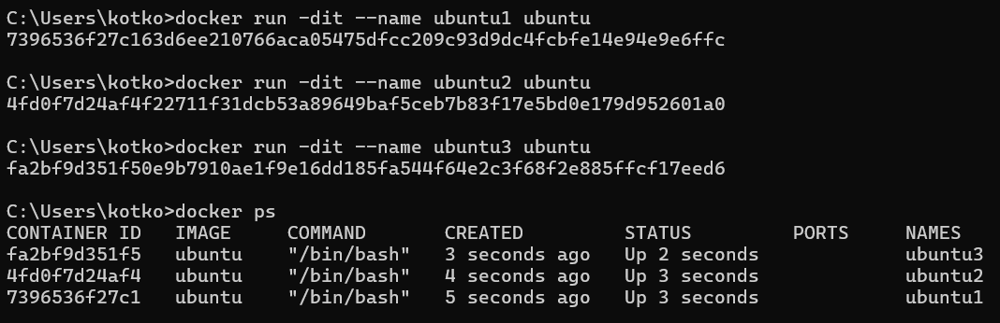

Stop two of the containers and leave one container running.

Submit the output for docker ps -a which shows 2 stopped containers and one running.
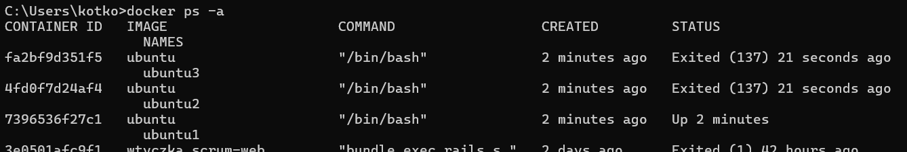
:::

:::info Exercise 1.2: Cleanup

We have containers and an image that are no longer in use and are taking up space. Running docker ps -a and docker image ls will confirm this.

Clean the Docker daemon by removing all images and containers.

Submit the output for docker ps -a and docker image ls

Nie będę usuwać obrazu ubuntu, bo go potrzebuję.
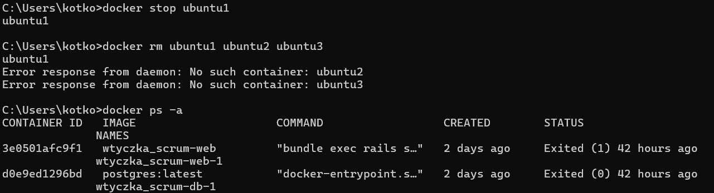

Exercise 1.3
:::info Exercise 1.3: Secret message

Now that we've warmed up it's time to get inside a container while it's running!

Image devopsdockeruh/simple-web-service:ubuntu will start a container that outputs logs into a file. Go inside the running container and use tail -f ./text.log to follow the logs. Every 10 seconds the clock will send you a "secret message".

Submit the secret message and command(s) given as your answer.
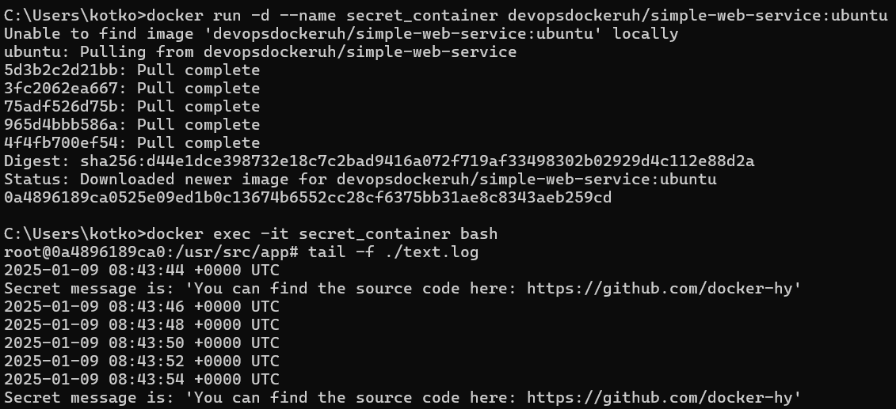

:::info Exercise 1.4: Missing dependencies

Start a Ubuntu image with the process sh -c 'while true; do echo "Input website:"; read website; echo "Searching.."; sleep 1; curl http://$website; done'

If you're on Windows, you'll want to switch the ' and " around: sh -c "while true; do echo 'Input website:'; read website; echo 'Searching..'; sleep 1; curl http://$website; done".

You will notice that a few things required for proper execution are missing. Be sure to remind yourself which flags to use so that the container actually waits for input.

Note also that curl is NOT installed in the container yet. You will have to install it from inside of the container.
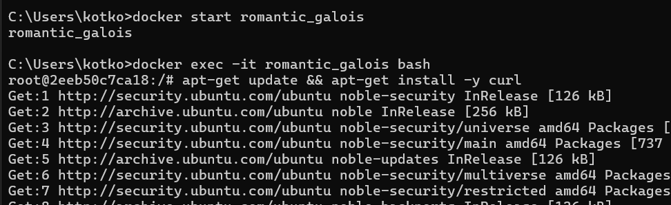
Test inputting helsinki.fi into the application. It should respond with something like

<html>
  <head>
    <title>301 Moved Permanently</title>
  </head>

  <body>
    <h1>Moved Permanently</h1>
    <p>The document has moved <a href="http://www.helsinki.fi/">here</a>.</p>
  </body>
</html>
This time return the command you used to start process and the command(s) you used to fix the ensuing problems.

Hint for installing the missing dependencies you could start a new process with docker exec.

This exercise has multiple solutions, if the curl for helsinki.fi works then it's done. Can you figure out other (smart) solutions?
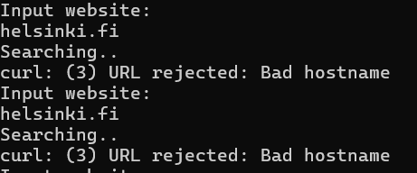
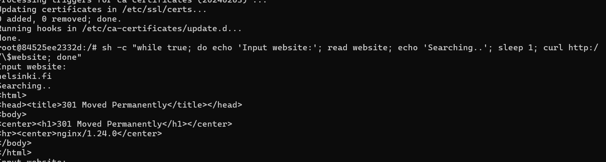
Exercises 1.5 - 1.6
:::info Exercise 1.5: Sizes of images

In the Exercise 1.3 we used devopsdockeruh/simple-web-service:ubuntu.

Here is the same application but instead of Ubuntu is using Alpine Linux: devopsdockeruh/simple-web-service:alpine.

Pull both images and compare the image sizes. Go inside the Alpine container and make sure the secret message functionality is the same. Alpine version doesn't have bash but it has sh, a more bare-bones shell.
Ubuntu-based image size: ~100MB
Alpine-based image size: ~15MB
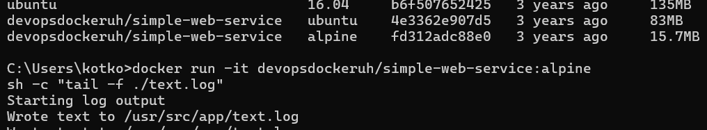
:::

:::info Exercise 1.6: Hello Docker Hub

Run docker run -it devopsdockeruh/pull_exercise.

The command will wait for your input.

Navigate through the Docker hub to find the docs and Dockerfile that was used to create the image.

Read the Dockerfile and/or docs to learn what input will get the application to answer a "secret message".

Submit the secret message and command(s) given to get it as your answer.
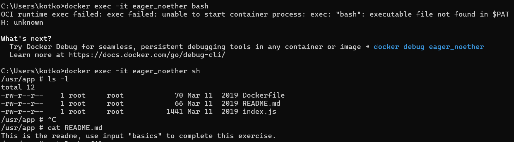
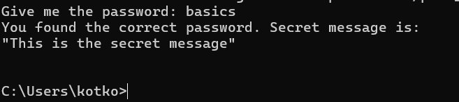
Exercises 1.7 - 1.8
:::info Exercise 1.7: Image for script

We can improve our previous solutions now that we know how to create and build a Dockerfile.

Let us now get back to Exercise 1.4.

Create a new file script.sh on your local machine with the following contents:

while true
do
echo "Input website:"
read website; echo "Searching.."
sleep 1; curl http://$website
done
Create a Dockerfile for a new image that starts from ubuntu:22.04 and add instructions to install curl into that image. Then add instructions to copy the script file into that image and finally set it to run on container start using CMD.

After you have filled the Dockerfile, build the image with the name "curler".

If you are getting permission denied, use chmod to give permission to run the script.
The following should now work:

$ docker run -it curler

Input website:
helsinki.fi
Searching..

  <!DOCTYPE HTML PUBLIC "-//IETF//DTD HTML 2.0//EN">
  <html><head>
  <title>301 Moved Permanently</title>
  </head><body>
  <h1>Moved Permanently</h1>
  <p>The document has moved <a href="https://www.helsinki.fi/">here</a>.</p>
  </body></html>
Remember that RUN can be used to execute commands while building the image!

Submit the Dockerfile.

:::

:::info Exercise 1.8: Two line Dockerfile

By default our devopsdockeruh/simple-web-service:alpine doesn't have a CMD. Instead, it uses ENTRYPOINT to declare which application is run.

We'll talk more about ENTRYPOINT in the next section, but you already know that the last argument in docker run can be used to give a command or an argument.

As you might've noticed it doesn't start the web service even though the name is "simple-web-service". A suitable argument is needed to start the server!

Try docker run devopsdockeruh/simple-web-service:alpine hello. The application reads the argument "hello" but will inform that hello isn't accepted.

In this exercise create a Dockerfile and use FROM and CMD to create a brand new image that automatically runs server.

The Docker documentation CMD says a bit indirectly that if a image has ENTRYPOINT defined, CMD is used to define it the default arguments.

Tag the new image as "web-server"

Return the Dockerfile and the command you used to run the container.

Running the built "web-server" image should look like this:

$ docker run web-server
[GIN-debug] [WARNING] Creating an Engine instance with the Logger and Recovery middleware already attached.

[GIN-debug] [WARNING] Running in "debug" mode. Switch to "release" mode in production.

- using env: export GIN_MODE=release
- using code: gin.SetMode(gin.ReleaseMode)

[GIN-debug] GET /\*path --> server.Start.func1 (3 handlers)
[GIN-debug] Listening and serving HTTP on :8080
We don't have any method of accessing the web service yet. As such confirming that the console output is the same will suffice.

The exercise title may be a useful hint here.
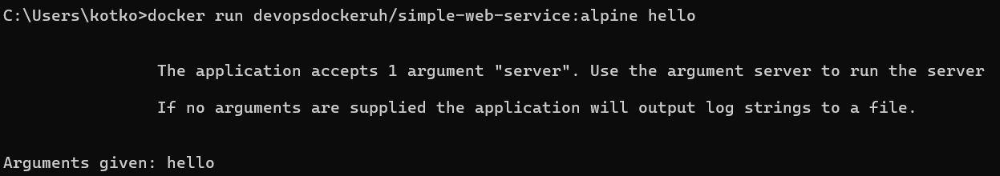

Dockerfile

```bash
FROM devopsdockeruh/simple-web-service:alpine
CMD ["server"]
```

[venv](ss/12.png)

Exercise 1.9
:::info Exercise 1.9: Volumes

In this exercise we won't create a new Dockerfile.

Image devopsdockeruh/simple-web-service creates a timestamp every two seconds to /usr/src/app/text.log when it's not given a command. Start the container with a bind mount so that the logs are created into your filesystem.

Submit the command you used to complete the exercise.

Hint: read the note that was made just before this exercise!

:::
[venv](ss/13.png)

Exercise 1.10
:::info Exercise 1.10: Ports open

In this exercise, we won't create a new Dockerfile.

The image devopsdockeruh/simple-web-service will start a web service in port 8080 when given the argument "server". In Exercise 1.8 you already did an image that can be used to run the web service without any argument.

Use now the -p flag to access the contents with your browser. The output to your browser should be something like: { message: "You connected to the following path: ...

Submit your used commands for this exercise.

[venv](ss/14.png)

Exercises 1.11-1.14
:::info Exercise 1.11: Spring

Create a Dockerfile for an old Java Spring project that can be found from the course repository.

The setup should be straightforward with the README instructions. Tips to get you started:

There are many options for running Java, you may use eg. amazoncorretto FROM amazoncorretto:_tag_ to get Java instead of installing it manually. Pick the tag by using the README and Docker Hub page.

You've completed the exercise when you see a 'Success' message in your browser.

Submit the Dockerfile you used to run the container.

```bash
Dockerfile
FROM openjdk:8-jdk-alpine

WORKDIR /app

COPY . .

RUN apk add --no-cache maven

RUN mvn package

EXPOSE 8080

CMD ["java", "-jar", "./target/docker-example-1.1.3.jar"]
```

[venv](ss/15.png)
[venv](ss/16.png)
:::

The following three exercises will start a larger project that we will configure in parts 2 and 3. They will require you to use everything you've learned up until now. If you need to modify a Dockerfile in some later exercises, feel free to do it on top of the Dockerfiles you create here.

:::warning Mandatory exercises The next exercises are the first mandatory ones. Mandatory exercises can not be skipped. :::

:::caution Mandatory Exercise 1.12: Hello, frontend!

A good developer creates well-written READMEs. Such that they can be used to create Dockerfiles with ease.

Clone, fork or download the project from https://github.com/docker-hy/material-applications/tree/main/example-frontend.

Create a Dockerfile for the project (example-frontend) and give a command so that the project runs in a Docker container with port 5000 exposed and published so when you start the container and navigate to http://localhost:5000 you will see message if you're successful.

note that the port 5000 is reserved in the more recent OSX versions (Monterey, Big Sur), so you have to use some other host port
Submit the Dockerfile.

As in other exercises, do not alter the code of the project

TIPS:

The project has install instructions in README.
Note that the app starts to accept connections when "Accepting connections at http://localhost:5000" has been printed to the screen, this takes a few seconds
You do not have to install anything new outside containers.
The project might not work with too new Node.js versions
:::

:::caution Mandatory Exercise 1.13: Hello, backend!

Clone, fork or download a project from https://github.com/docker-hy/material-applications/tree/main/example-backend.

Create a Dockerfile for the project (example-backend). Start the container with port 8080 published.

When you start the container and navigate to http://localhost:8080/ping you should get a "pong" as a response.

Submit the Dockerfile and the command used.

Do not alter the code of the project

TIPS:

you might need this
If you have M1/M2 Mac, you might need to build the image with an extra option docker build --platform linux/amd64 -t imagename .
:::

```bash
FROM node:16

WORKDIR /app

COPY . .

RUN npm install

RUN npm run build

RUN npm install -g serve

EXPOSE 5000

CMD ["serve", "-s", "-l", "5000", "build"]
```

[venv](ss/17.png)
[venv](ss/18.png)

Exercise 1.14: Environment

Start both the frontend and the backend with the correct ports exposed and add ENV to Dockerfile with the necessary information from both READMEs (front, back).

Ignore the backend configurations until the frontend sends requests to _backend_url_/ping when you press the button.

You know that the configuration is ready when the button for 1.14 of frontend responds and turns green.

Do not alter the code of either project

Submit the edited Dockerfiles and commands used to run.

Backend and Frontend

The frontend will first talk to your browser. Then the code will be executed from your browser and that will send a message to the backend.

More information about connection between frontend and backend

TIPS:

When configuring web applications keep the browser developer console ALWAYS open, F12 or cmd+shift+I when the browser window is open. Information about configuring cross-origin requests is in the README of the backend project.
The developer console has multiple views, the most important ones are Console and Network. Exploring the Network tab can give you a lot of information on where messages are being sent and what is received as a response!
:::

```bash
Dockerfile backend
FROM golang:1.16-alpine

WORKDIR /app

COPY . .

RUN go mod tidy

RUN go build -o server

ENV PORT=8080
ENV REQUEST_ORIGIN=https://example.com

EXPOSE 8080

CMD ["./server"]
```

```bash
docker-compose.yml
version: '3.7'

services:
  backend:
    build:
      context: ./example-backend
    ports:
      - "8080:8080"
    environment:
      - PORT=8080
      - REQUEST_ORIGIN=https://example.com

  frontend:
    build:
      context: ./example-frontend
    ports:
      - "5000:5000"
    depends_on:
      - backend
```

[venv](ss/19.png)
