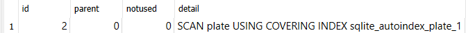

1. Selecting All Values from Table

```bash
select * from little_penguins;
```

2. Specifying Columns

```bash
select
    species,
    island,
    sex
from little_penguins;
```


3. Sorting

```bash
select
    species,
    sex,
    island
from little_penguins
order by island asc, sex desc;
```

 4. Exercise
Write a SQL query to select the sex and body mass columns from the little_penguins in that order, sorted such that the largest body mass appears first.

```bash
SELECT sex, body_mass_g
FROM little_penguins
ORDER BY body_mass_g DESC;
```


5. Limiting Output

```bash
select
    species,
    sex,
    island
from penguins
order by species, sex, island
limit 10;
```


6.Paging Output

```bash
select
    species,
    sex,
    island
from penguins
order by species, sex, island
limit 10 offset 3;
```


7.Removing Duplicates

````bash
select distinct
    species,
    sex,
    island
from penguins;
```


8. Exercise
Write a SQL query to select the islands and species from rows 50 to 60 inclusive of the penguins table. Your result should have 11 rows.

Modify your query to select distinct combinations of island and species from the same rows and compare the result to what you got in part 1.

```bash
SELECT island, species
FROM (
    SELECT *,
           ROW_NUMBER() OVER (ORDER BY species) AS row_num
    FROM penguins
) AS numbered_rows
WHERE row_num BETWEEN 50 AND 60;

SELECT DISTINCT island, species
FROM (
    SELECT *,
           ROW_NUMBER() OVER (ORDER BY species) AS row_num
    FROM penguins
) AS numbered_rows
WHERE row_num BETWEEN 50 AND 60;

````


9. Filtering Results

```bash
select distinct
    species,
    sex,
    island
from penguins
where island = 'Biscoe';
```


10. Exercise
    Write a query to select the body masses from penguins that are less than 3000.0 grams.

Write another query to select the species and sex of penguins that weight less than 3000.0 grams. This shows that the columns displayed and those used in filtering are independent of each other.

```bash
SELECT body_mass_g
FROM penguins
WHERE body_mass_g < 3000.0;


SELECT species, sex
FROM penguins
WHERE body_mass_g < 3000.0;
```


11. Exercise
    Use the not operator to select penguins that are not Gentoos.

SQL’s or is an inclusive or: it succeeds if either or both conditions are true. SQL does not provide a specific operator for exclusive or, which is true if either but not both conditions are true, but the same effect can be achieved using and, or, and not. Write a query to select penguins that are female or on Torgersen Island but not both.

```bash
SELECT *
FROM penguins
WHERE species <> 'Gentoos';


SELECT *
FROM penguins
WHERE (sex = 'female' OR island = 'Torgersen') AND NOT (sex = 'female' AND island = 'Torgersen');

```


12. Doing Calculations

```bash
select
    flipper_length_mm / 10.0,
    body_mass_g / 1000.0
from penguins
limit 3;
```


13. Exercise
    Write a single query that calculates and returns:

A column called what_where that has the species and island of each penguin separated by a single space.
A column called bill_ratio that has the ratio of bill length to bill depth.
You can use the || operator to concatenate text to solve part 1, or look at the documentation for SQLite’s format() function.

```bash
SELECT
    species || ' ' || island AS what_where,
    bill_length_mm / bill_depth_mm AS bill_ratio
FROM penguins;
```


14. Calculating with Missing Values

```bash
select
    flipper_length_mm / 10.0 as flipper_cm,
    body_mass_g / 1000.0 as weight_kg,
    island as where_found
from penguins
limit 5;
```


15. Exercise
    Use SQLite’s .nullvalue command to change the printed representation of null to the string null and then re-run the previous query. When will displaying null as null be easier to understand? When might it be misleading?

```bash
.nullvalue null
```

Użycie polecenia .nullvalue w SQLite pozwala zmienić drukowaną reprezentację wartości null na określony ciąg znaków, na przykład "null".

16. Null Equality

```bash
select distinct
    species,
    sex,
    island
from penguins
where island = 'Biscoe';

select distinct
    species,
    sex,
    island
from penguins
where island = 'Biscoe' and sex = 'FEMALE';
```


17. Null Inequality

```bash
select distinct
    species,
    sex,
    island
from penguins
where island = 'Biscoe' and sex != 'FEMALE';
```


18. Handling Null Safely

```bash
select
    species,
    sex,
    island
from penguins
where sex is null;
```


19. Exercise
    Write a query to find penguins whose body mass is known but whose sex is not.

Write another query to find penguins whose sex is known but whose body mass is not.

```bash
SELECT *
FROM penguins
WHERE body_mass_g IS NOT NULL AND sex IS NULL;

SELECT *
FROM penguins
WHERE sex IS NOT NULL AND body_mass_g IS NULL;
```


20. Aggregating

```bash
select sum(body_mass_g) as total_mass
from penguins;
```


21. Common Aggregation Functions

```bash
select
    max(bill_length_mm) as longest_bill,
    min(flipper_length_mm) as shortest_flipper,
    avg(bill_length_mm) / avg(bill_depth_mm) as weird_ratio
from penguins;
```


22. Exercise
    What is the average body mass of penguins that weight more than 3000.0 grams?

```bash
SELECT AVG(body_mass_g) AS średnia_masa_ciała
FROM penguins
WHERE body_mass_g > 3000.0;
```

To zapytanie oblicza średnią masę ciała (AVG(body_mass_g)) pingwinów z tabeli penguins, gdzie masa ciała jest większa niż 3000,0 gramów (WHERE body_mass_g > 3000.0).


23. Counting

```bash
select
    count(*) as count_star,
    count(sex) as count_specific,
    count(distinct sex) as count_distinct
from penguins;
```


24. Exercise
    How many different body masses are in the penguins dataset?

```bash
SELECT COUNT(DISTINCT body_mass_g) AS different_body_masses
FROM penguins;

```


25. Grouping

```bash
select avg(body_mass_g) as average_mass_g
from penguins
group by sex;
```


26. Exercise
    Explain why the output of the previous query has a blank line before the rows for female and male penguins.

Write a query that shows each distinct body mass in the penguin dataset and the number of penguins that weigh that much.

Wynik poprzedniego zapytania zawiera pustą linię przed wierszami dla pingwinów o płci żeńskiej i męskiej, ponieważ te wiersze zostały oddzielone przez wartość null w kolumnie płci. Spowodowane jest to faktem, że dla niektórych pingwinów nie jest znana płci, co jest reprezentowane przez wartość null.

Zapytanie wyświetlające każdą różną masę ciała w zestawie danych pingwinów oraz liczbę pingwinów o takiej masie:

```bash
SELECT body_mass_g, COUNT(*) AS num_penguins
FROM penguins
GROUP BY body_mass_g;

```


27. Filtering Aggregated Values

```bash
select
    sex,
    avg(body_mass_g) as average_mass_g
from penguins
group by sex
having average_mass_g > 4000.0;
```


28. Readable Output

```bash
select
    sex,
    round(avg(body_mass_g), 1) as average_mass_g
from penguins
group by sex
having average_mass_g > 4000.0;
```


29. Exercise
    Write a query that uses filter to calculate the average body masses of heavy penguins (those over 4500 grams) and light penguins (those under 3500 grams) simultaneously. Is it possible to do this using where instead of filter?

Użycie klauzuli WHERE zamiast FILTER w tym przypadku nie zadziała, ponieważ WHERE służy do filtrowania wierszy, podczas gdy FILTER jest używane do stosowania warunków do funkcji agregujących.

```bash
select
SELECT
    AVG(body_mass_g) FILTER (WHERE body_mass_g > 4500) AS average_heavy_mass,
    AVG(body_mass_g) FILTER (WHERE body_mass_g < 3500) AS average_light_mass
FROM penguins;

```


30. Creating In-memory Database

```bash
sqlite3 :memory:
```

31. Creating Tables

```bash
create table job (
    name text not null,
    billable real not null
);
create table work (
    person text not null,
    job text not null
);
```


32. Inserting data

```bash
insert into job values
('calibrate', 1.5),
('clean', 0.5);
insert into work values
('mik', 'calibrate'),
('mik', 'clean'),
('mik', 'complain'),
('po', 'clean'),
('po', 'complain'),
('tay', 'complain');
```


33. Updating Rows

```bash
update work
set person = 'tae'
where person = 'tay';
```


34. What happens if you try to delete rows that don’t exist (e.g., all entries in work that refer to juna)?
    Operacja DELETE nie powoduje błędu ani żadnych zmian w bazie danych, jeśli nie ma pasujących wierszy do usunięcia.

35. Backing Up

```bash
create table backup (
    person text not null,
    job text not null
);

insert into backup
select
    person,
    job
from work
where person = 'tae';

delete from work
where person = 'tae';

select * from backup;
```

36. Combining Information

```bash
select *
from work cross join job;
```


TOOLS

1. Negating Incorrectly

```bash
select distinct person
from work
where job != 'calibrate';
```


2. Set Membership

```bash
select *
from work
where person not in ('mik', 'tay');
```


3. Subqueries

```bash
select distinct person
from work
where person not in (
    select distinct person
    from work
    where job = 'calibrate'
);
```


4. Defining a Primary Key

```bash
create table lab_equipment (
    size real not null,
    color text not null,
    num integer not null,
    primary key (size, color)
);

insert into lab_equipment values
(1.5, 'blue', 2),
(1.5, 'green', 1),
(2.5, 'blue', 1);

select * from lab_equipment;

insert into lab_equipment values
(1.5, 'green', 2);
```


5. Autoincrementing and Primary Keys

```bash
create table person (
    ident integer primary key autoincrement,
    name text not null
);
insert into person values
(null, 'mik'),
(null, 'po'),
(null, 'tay');
select * from person;
insert into person values (1, 'prevented');
```


6. Creating New Tables from Old

```bash
create table new_work (
    person_id integer not null,
    job_id integer not null,
    foreign key (person_id) references person (ident),
    foreign key (job_id) references job (ident)
);

insert into new_work
select
    person.ident as person_id,
    job.ident as job_id
from
    (person inner join work on person.name = work.person)
    inner join job on job.name = work.job;
select * from new_work;
```


7. Removing Tables

```bash
drop table work;
alter table new_work rename to work;
CREATE TABLE job (
    ident integer primary key autoincrement,
    name text not null,
    billable real not null
);
CREATE TABLE sqlite_sequence(name,seq);
CREATE TABLE person (
    ident integer primary key autoincrement,
    name text not null
);
CREATE TABLE IF NOT EXISTS "work" (
    person_id integer not null,
    job_id integer not null,
    foreign key(person_id) references person(ident),
    foreign key(job_id) references job(ident)
);
```


stare tabele zostały skasowane a nowe podmienione

8. Comparing Individual Values to Aggregates

```bash
select body_mass_g
from penguins
where
    body_mass_g > (
        select avg(body_mass_g)
        from penguins
    )
limit 5;
```


9. Comparing Individual Values to Aggregates Within Groups

```bash
select
    penguins.species,
    penguins.body_mass_g,
    round(averaged.avg_mass_g, 1) as avg_mass_g
from penguins inner join (
    select
        species,
        avg(body_mass_g) as avg_mass_g
    from penguins
    group by species
) as averaged
    on penguins.species = averaged.species
where penguins.body_mass_g > averaged.avg_mass_g
limit 5;
```


10. Common Table Expressions

```bash
with grouped as (
    select
        species,
        avg(body_mass_g) as avg_mass_g
    from penguins
    group by species
)

select
    penguins.species,
    penguins.body_mass_g,
    round(grouped.avg_mass_g, 1) as avg_mass_g
from penguins inner join grouped
where penguins.body_mass_g > grouped.avg_mass_g
limit 5;
```


11. Conditionals

```bash
with sized_penguins as (
    select
        species,
        iif(
            body_mass_g < 3500,
            'small',
            'large'
        ) as size
    from penguins
    where body_mass_g is not null
)

select
    species,
    size,
    count(*) as num
from sized_penguins
group by species, size
order by species, num;
```


12. Selecting a Case

```bash
with sized_penguins as (
    select
        species,
        case
            when body_mass_g < 3500 then 'small'
            when body_mass_g < 5000 then 'medium'
            else 'large'
        end as size
    from penguins
    where body_mass_g is not null
)

select
    species,
    size,
    count(*) as num
from sized_penguins
group by species, size
order by species, num;
```


13. Checking a Range

```bash
with sized_penguins as (
    select
        species,
        case
            when body_mass_g between 3500 and 5000 then 'normal'
            else 'abnormal'
        end as size
    from penguins
    where body_mass_g is not null
)

select
    species,
    size,
    count(*) as num
from sized_penguins
group by species, size
order by species, num;
```


14. Pattern Matching

```bash
select
    personal,
    family
from staff
where personal like '%ya%';
```


15. Intersection

```bash
select
    personal,
    family,
    dept,
    age
from staff
where dept = 'mb'
intersect
select
    personal,
    family,
    dept,
    age from staff
where age < 50;
```


16. Exclusion

```bash
select
    personal,
    family,
    dept,
    age
from staff
where dept = 'mb'
except
    select
        personal,
        family,
        dept,
        age from staff
    where age < 50;
```


17. Random Numbers and Why Not

```bash
with decorated as (
    select random() as rand,
    personal || ' ' || family as name
    from staff
)

select
    rand,
    abs(rand) % 10 as selector,
    name
from decorated
where selector < 5;
```


18. Creating an Index

```bash
explain query plan
select filename
from plate
where filename like '%07%';

create index plate_file on plate(filename);

explain query plan
select filename
from plate
where filename like '%07%';
```



19. Self join

```bash
with person as (
    select
        ident,
        personal || ' ' || family as name
    from staff
)

select
    left_person.name,
    right_person.name
from person as left_person inner join person as right_person
limit 10;
```


20. Generating Unique Pairs

```bash
with person as (
    select
        ident,
        personal || ' ' || family as name
    from staff
)

select
    left_person.name,
    right_person.name
from person as left_person inner join person as right_person
on left_person.ident < right_person.ident
where left_person.ident <= 4 and right_person.ident <= 4
```


21. Filtering Pairs

```bash
with
person as (
    select
        ident,
        personal || ' ' || family as name
    from staff
),

together as (
    select
        left_perf.staff as left_staff,
        right_perf.staff as right_staff
    from performed as left_perf inner join performed as right_perf
        on left_perf.experiment = right_perf.experiment
    where left_staff < right_staff
)

select
    left_person.name as person_1,
    right_person.name as person_2
from person as left_person inner join person as right_person join together
    on left_person.ident = left_staff and right_person.ident = right_staff;
```


22. Existence and Correlated Subqueries

```bash
select
    name,
    building
from department
where
    exists (
        select 1
        from staff
        where dept = department.ident
    )
order by name;
```


23. Nonexistence

```bash
select
    name,
    building
from department
where
    not exists (
        select 1
        from staff
        where dept = department.ident
    )
order by name;
```


24. Avoiding Correlated Subqueries

```bash
select distinct
    department.name as name,
    department.building as building
from department inner join staff
    on department.ident = staff.dept
order by name;;
```


25. Lead and Lag

```bash
with ym_num as (
    select
        strftime('%Y-%m', started) as ym,
        count(*) as num
    from experiment
    group by ym
)

select
    ym,
    lag(num) over (order by ym) as prev_num,
    num,
    lead(num) over (order by ym) as next_num
from ym_num
order by ym;
```

 26. Windowing Functions

```bash
with ym_num as (
    select
        strftime('%Y-%m', started) as ym,
        count(*) as num
    from experiment
    group by ym
)

select
    ym,
    num,
    sum(num) over (order by ym) as num_done,
    (sum(num) over (order by ym) * 1.00) / (select sum(num) from ym_num) as completed_progress,
    cume_dist() over (order by ym) as linear_progress
from ym_num
order by ym;
```


27. Explaining Another Query Plan

```bash
explain query plan
with ym_num as (
    select
        strftime('%Y-%m', started) as ym,
        count(*) as num
    from experiment
    group by ym
)
select
    ym,
    num,
    sum(num) over (order by ym) as num_done,
    cume_dist() over (order by ym) as progress
from ym_num
order by ym;
```


28. Partitioned Windows

```bash
with y_m_num as (
    select
        strftime('%Y', started) as year,
        strftime('%m', started) as month,
        count(*) as num
    from experiment
    group by year, month
)

select
    year,
    month,
    num,
    sum(num) over (partition by year order by month) as num_done
from y_m_num
order by year, month;
```


ADVANCED FEATURES

1. Blobs

```bash
create table images (
    name text not null,
    content blob
);

insert into images (name, content) values
('biohazard', readfile('img/biohazard.png')),
('crush', readfile('img/crush.png')),
('fire', readfile('img/fire.png')),
('radioactive', readfile('img/radioactive.png')),
('tripping', readfile('img/tripping.png'));

select
    name,
    length(content)
from images;
```

2. Refreshing the Penguins Database

```bash
select
    species,
    count(*) as num
from penguins
group by species;
```


3. Tombstones

```bash
alter table penguins
add active integer not null default 1;

update penguins
set active = iif(species = 'Adelie', 0, 1);
select
    species,
    count(*) as num
from penguins
where active
group by species;
```


SKRYPTY PYTHON

1. Quering from python

```bash
import sqlite3
import sys

db_path = "db/penguins.db"
connection = sqlite3.connect(db_path)
cursor = connection.execute("select count(*) from penguins;")
rows = cursor.fetchall()
print(rows)
```


2. Incremental Fetch

```bash
import sqlite3
import sys

db_path = "db/penguins.db"
connection = sqlite3.connect(db_path)
cursor = connection.cursor()
cursor = cursor.execute("select species, island from penguins limit 5;")
while row := cursor.fetchone():
    print(row)
```


3. Insert, Delete, and All That

```bash
import sqlite3

connection = sqlite3.connect(":memory:")
cursor = connection.cursor()
cursor.execute("create table example(num integer);")

cursor.execute("insert into example values (10), (20);")
print("after insertion", cursor.execute("select * from example;").fetchall())

cursor.execute("delete from example where num < 15;")
print("after deletion", cursor.execute("select * from example;").fetchall())
```


4. Interpolating Values

```bash
import sqlite3

connection = sqlite3.connect(":memory:")
cursor = connection.cursor()
cursor.execute("create table example(num integer);")

cursor.executemany("insert into example values (?);", [(10,), (20,)])
print("after insertion", cursor.execute("select * from example;").fetchall())
```


5. Script Execution

```bash
import sqlite3

SETUP = """\
drop table if exists example;
create table example(num integer);
insert into example values (10), (20);
"""

connection = sqlite3.connect(":memory:")
cursor = connection.cursor()
cursor.executescript(SETUP)
print("after insertion", cursor.execute("select * from example;").fetchall())
```


6. SQLite Exceptions in Python

```bash
import sqlite3

SETUP = """\
create table example(num integer check(num > 0));
insert into example values (10);
insert into example values (-1);
insert into example values (20);
"""

connection = sqlite3.connect(":memory:")
cursor = connection.cursor()
try:
    cursor.executescript(SETUP)
except sqlite3.Error as exc:
    print(f"SQLite exception: {exc}")
print("after execution", cursor.execute("select * from example;").fetchall())
```


7. Python in SQLite

```bash
import sqlite3

SETUP = """\
create table example(num integer);
insert into example values (-10), (10), (20), (30);
"""


def clip(value):
    if value < 0:
        return 0
    if value > 20:
        return 20
    return value


connection = sqlite3.connect(":memory:")
connection.create_function("clip", 1, clip)
cursor = connection.cursor()
cursor.executescript(SETUP)
for row in cursor.execute("select num, clip(num) from example;").fetchall():
    print(row)
```


8. Handling Dates and Times

```bash
from datetime import date
import sqlite3


# Convert date to ISO-formatted string when writing to database
def _adapt_date_iso(val):
    return val.isoformat()


sqlite3.register_adapter(date, _adapt_date_iso)


# Convert ISO-formatted string to date when reading from database
def _convert_date(val):
    return date.fromisoformat(val.decode())


sqlite3.register_converter("date", _convert_date)

SETUP = """\
create table events(
    happened date not null,
    description text not null
);
"""

connection = sqlite3.connect(":memory:", detect_types=sqlite3.PARSE_DECLTYPES)
cursor = connection.cursor()
cursor.execute(SETUP)

cursor.executemany(
    "insert into events values (?, ?);",
    [(date(2024, 1, 10), "started tutorial"), (date(2024, 1, 29), "finished tutorial")],
)

for row in cursor.execute("select * from events;").fetchall():
    print(row)
```


