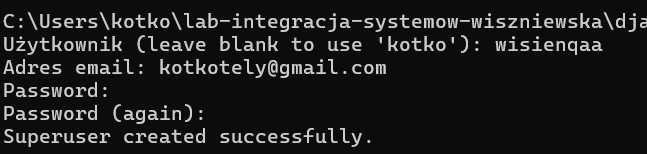
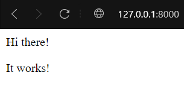
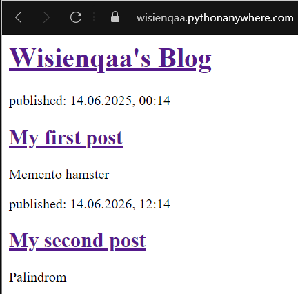
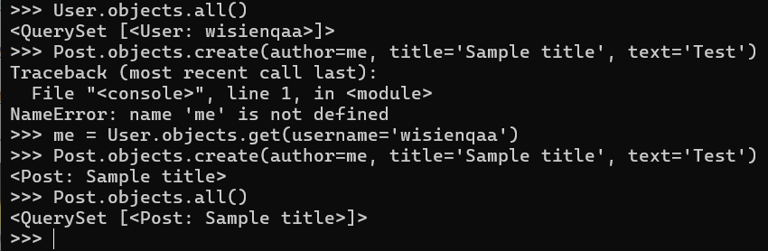
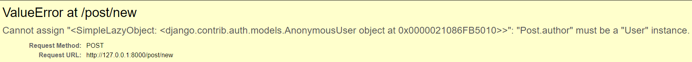

I. Dokumentacja - https://tutorial.djangogirls.org/en/

II. Uwagi:  
-każdą czynność zrealizowaną wpisujemy do punktu III wraz z użytą komendą np.

```bash
python manage.py makemigrations
```

-wymagane konto na Python Anywhere https://www.pythonanywhere.com, nazwa użytkownika taka sama jak na dc


III. Kolejne kroki:
-utworzenie środowiska wirtualnego, nazwa środowiska zawiera nr albumu lub nick z dc

```bash
python3 -m venv env_wiszniewska
```

-aktywacja środowiska

```bash
source env_wiszniewska/Scripts activate
```

-robimy screenshoty z aktywnym środowiskiem wirtualnym, wrzucamy tutaj jako obrazek  

-dodajemy nazwę środowiska wirutalnego do pliku .gitignore
-pomyślnie zainstalowałam django i zupgradowałam pip do 24.0

```bash
(myvenv) ~$ python -m pip install -upgrade pip
(myvenv) ~$ pip install -r requirements.txt
```

-tworzenie projektu

```bash
(myvenv) C:\Users\Name\djangogirls> django-admin.exe startproject mysite .
```


Widzimy folder mysite, struktura katalogów ma się następująco:  
djangogirls  
├───manage.py  
├───mysite  
│ settings.py  
│ urls.py  
│ wsgi.py  
│ **init**.py  
└───requirements.txt

-zmiana ustawień w pliku mysite/settings.py (czas, język, ścieżka do plików statycznych, zmiana nazwy hosta)

```
TIME_ZONE = 'Europe/Warsaw'
LANGUAGE_CODE = 'pl-pl'
STATIC_ROOT = BASE_DIR / 'static'
ALLOWED_HOSTS = ['127.0.0.1', '.pythonanywhere.com']
```

-inicjalizacja bazy danych

```bash
python manage.py migrate
```

-inicjalizacja serwera


-tworzenie aplikacji

```bash
python manage.py startapp blog
```

-dodanie aplikacji w ustawieniach django mysite/settings.py

```bash
INSTALLED_APPS = [
    ...,
    'blog',
]
```

-utworzenie modelu wpisu na blogu (kod wg. tutoriala od djangogrils)  
-utworzenie tabeli dla modeli w bazie danych  


-Następny krok to administracja django
Utworzyłam superusera


-utworzenie API Tokenu na python anywhere

-wpisanie w terminal na stronie python anywhere

```bash
pip3.6 install --user pythonanywhere
pa_autoconfigure_django.py https://github.com/Wisienkaa/lab-integracja-systemow-wiszniewska.git
python manage.py createsuperuser
```

Widok strony już na żywo po dodaniu na końcu adresu url /admin/


-tworzenie pierwszego adresu url w django (mysite/urls.py)

```bash
from django.contrib import admin
from django.urls import path, include

urlpatterns = [
    path('admin/', admin.site.urls),
    path('', include('blog.urls')),
]
```

-Kod do urls.py w katalogu blog

```bash
from django.urls import path
from . import views

urlpatterns = [
    path('', views.post_list, name='post_list'),
]
```

-utworzenie superuser w python anywhere  
-po utworzeniu superusera przeszłam w adres url z końcówką /admin i zalogowałam się na swoje konto administratora, a następnie dodałam swój pierwszy post  


-utworzenie pliku post-list.html w ścieżce blog/templates/blog

-pierwszy szablon  


-zrobienie git push lokalnie i git pull w python anywhere oraz reload strony  
 

-Dodanie wpisu za pomocą konsoli Django


-dodanie pliku css z wykorzystaniem elementów bootstrapa i utworzenie szablonu base.html (szablonu bazowego)

-tworzenie odnośnika do detali na blogu

```bash
<h1><a href="">{{ post.title }}</a></h1>
```

-dodanie URL dla poszczególnych plików

```bash
urlpatterns = [
    path('', views.post_list, name='post_list'),
    path('post/<int:pk>/', views.post_detail, name='post_detail'),
]
```

-dodanie widoku dla poszczególnych plików w kodzie views.py, by nie wyskawiał error DoesNotExtist

```bash
from django.shortcuts import render, get_object_or_404

def post_detail(request, pk):
    post = get_object_or_404(Post, pk=pk)
    return render(request, 'blog/post_detail.html', {'post': post})
```

-aktualizacja plików statyscznych na serwerze python anywhere w konsoli bash

```bash
python manage.py collectstatic
```

-utworzenie pliku forms.py w katalogu blog

```bash
class PostForm(forms.ModelForm):

    class Meta:
        model = Post
        fields = ('title', 'text',)
```

-dodanie odnośnika z komentarzem w pliku base.html

```bash
<a href="" class="top-menu"><span class="glyphicon glyphicon-plus"></span></a>
```

-dodanie adrsu URL w pliku urls.py

```bash
urlpatterns = [
    path('', views.post_list, name='post_list'),
    path('post/<int:pk>/', views.post_detail, name='post_detail'),
    path('post/new', views.post_new, name='post_new'),
]
```

-utworzenie formularza dodającego wpis (aczkolwiek jeszcze nie działa bo user jest anonimowy)
KOD views.py

```bash
def post_new(request):
    if request.method == "POST":
        form = PostForm(request.POST)
        if form.is_valid():
            post = form.save(commit=False)
            post.author = request.user
            post.published_date = timezone.now()
            post.save()
            return redirect('post_detail', pk=post.pk)
    else:
        form = PostForm()
    return render(request, 'blog/post_edit.html', {'form': form})
```



-dodanie opcji edycji formularza  
blog/templates/blog/post_detail.html

```bash
<a class="btn btn-default" href=""><span class="glyphicon glyphicon-pencil"></span></a>
```

blog/templates/blog/post_detail.html

```bash



    <div class="post">
        
            <div class="date">
                {{ post.published_date }}
            </div>
        
        <a class="btn btn-default" href=""><span class="glyphicon glyphicon-pencil"></span></a>
        <h1>{{ post.title }}</h1>
        <p>{{ post.text|linebreaksbr }}</p>
    </div>

```

blog/urls.py

```bash
 path('post/<int:pk>/edit/', views.post_edit, name='post_edit'),
```

blog/views.py

```bash
 def post_edit(request, pk):
    post = get_object_or_404(Post, pk=pk)
    if request.method == "POST":
        form = PostForm(request.POST, instance=post)
        if form.is_valid():
            post = form.save(commit=False)
            post.author = request.user
            post.published_date = timezone.now()
            post.save()
            return redirect('post_detail', pk=post.pk)
    else:
        form = PostForm(instance=post)
    return render(request, 'blog/post_edit.html', {'form': form})
```

-jednak wszystko działa, zalogowałam się w panelu administracyjnym i mogę teraz dodawać i edytować posty na swojej stronie dowolnie!


-dodanie zabezpieczeń  
blog/templates/blog/base.html

```bash

    <a href="" class="top-menu"><span class="glyphicon glyphicon-plus"></span></a>

```

blog/templates/blog/post_detail.html

```bash

     <a class="btn btn-default" href=""><span class="glyphicon glyphicon-pencil"></span></a>

```
