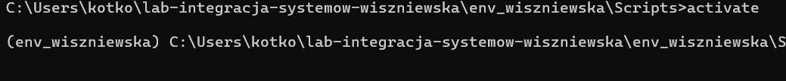
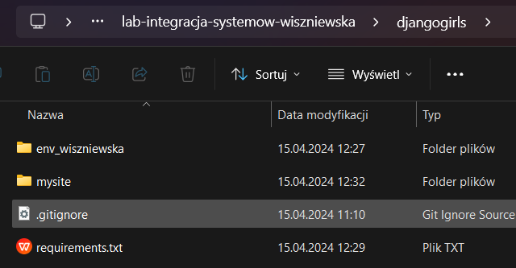
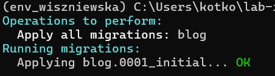

I. Dokumentacja - https://tutorial.djangogirls.org/en/

II. Uwagi:  
-każdą czynność zrealizowaną wpisujemy do punktu III wraz z użytą komendą np.

```bash
python manage.py makemigrations
```

-wymagane konto na Python Anywhere https://www.pythonanywhere.com, nazwa użytkownika taka sama jak na dc


III. Kolejne kroki:
-utworzenie środowiska wirtualnego, nazwa środowiska zawiera nr albumu lub nick z dc

```bash
python3 -m venv env_wiszniewska
```

-aktywacja środowiska

```bash
source env_wiszniewska/Scripts activate
```

-robimy screenshoty z aktywnym środowiskiem wirtualnym, wrzucamy tutaj jako obrazek  

-dodajemy nazwę środowiska wirutalnego do pliku .gitignore
-pomyślnie zainstalowałam django i zupgradowałam pip do 24.0

```bash
(myvenv) ~$ python -m pip install -upgrade pip
(myvenv) ~$ pip install -r requirements.txt
```

-tworzenie projektu

```bash
(myvenv) C:\Users\Name\djangogirls> django-admin.exe startproject mysite .
```



Widzimy folder mysite, struktura katalogów ma się następująco:  
djangogirls  
├───manage.py  
├───mysite  
│ settings.py  
│ urls.py  
│ wsgi.py  
│ **init**.py  
└───requirements.txt

-zmiana ustawień w pliku mysite/settings.py (czas, język, ścieżka do plików statycznych, zmiana nazwy hosta)

```
TIME_ZONE = 'Europe/Warsaw'
LANGUAGE_CODE = 'pl-pl'
STATIC_ROOT = BASE_DIR / 'static'
ALLOWED_HOSTS = ['127.0.0.1', '.pythonanywhere.com']
```

-inicjalizacja bazy danych

```bash
python manage.py migrate
```

-inicjalizacja serwera


-tworzenie aplikacji

```bash
python manage.py startapp blog
```

-dodanie aplikacji w ustawieniach django mysite/settings.py

```
INSTALLED_APPS = [
    ...,
    'blog',
]
```

-utworzenie modelu wpisu na blogu (kod wg. tutoriala od djangogrils)  
-utworzenie tabeli dla modeli w bazie danych  


-Następny krok to administracja django
